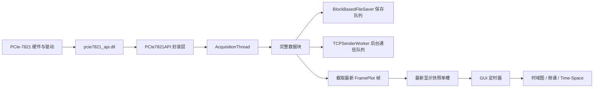
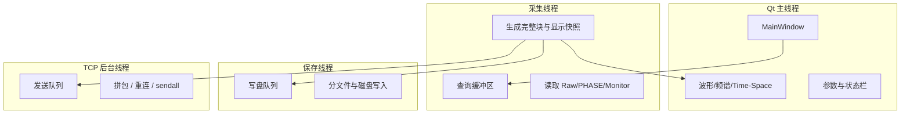

# PCIe-7821 eDAS 上位机开发文档

## 1. 项目定位

本项目是一个面向 PCIe-7821 采集卡的 eDAS 上位机，使用 `PyQt5` 构建桌面 GUI，围绕“持续采集、实时显示、后台存储、可选 TCP 转发”四条主线组织代码。当前版本不是通用框架，而是结合 DAS 场景做过多轮性能修正和现场问题回灌后的工程版本，因此它最有参考价值的地方不是界面外观，而是它如何处理高吞吐实时链路中的线程边界、显示退化策略和异常恢复策略。

如果把本项目作为后续类似系统的参考样本，可以把它理解为一个典型的“设备 DLL + 采集线程 + GUI 总控 + 后台写盘 + 后台网络发送”的单体桌面程序。与很多只在演示数据上可用的原型不同，这个版本已经把 `FrameLoad`、`FramePlot`、GUI 队列积压、停滞检测、磁盘队列压力和通信链路背压等问题显式纳入设计。

## 2. 代码结构与职责分工

当前代码入口很简单。根目录的 `run.py` 只负责把 `src/` 加入 `sys.path` 并调用 `src/main.py` 中的 `main()`。真正的应用启动逻辑，包括命令行参数、日志初始化、高 DPI 设置、全局异常钩子以及 `QApplication` 和主窗口创建，都在 `src/main.py` 中。

`src/main_window.py` 是整个程序的业务总控。它不只是 UI 文件，而是把参数采集与校验、设备初始化、采集线程启停、数据显示、频谱分析、Time-Space 控件、异步写盘、TCP 通信、系统状态更新、自动恢复和本地参数持久化全部编排在一个窗口生命周期内。当前架构的优点是现场排障路径短，参数变化到显示、保存和通信的传播关系也更直接；代价是主窗口文件体量较大，因此后续维护时必须特别重视模块边界和注释准确性。

`src/config.py` 定义了整个程序的参数模型。`AllParams` 是当前事实上的跨模块接口，内部包含 `BasicParams`、`UploadParams`、`PhaseDemodParams`、`DisplayParams`、`SaveParams` 和 `TimeSpaceParams` 等分组。这个模块里最值得保留的做法，是把硬件参数和上位机策略参数同时纳入统一模型，但又通过字段语义把两者区分清楚。例如 `scan_rate`、`point_num_per_scan` 更接近设备配置，而 `frame_load_num`、`frame_plot_num` 明确属于上位机读取和显示策略。

`src/pcie7821_api.py` 是底层 DLL 边界层，负责 DLL 查找、ctypes 原型声明、DMA 对齐缓冲区分配、线程互斥保护和错误码转换。这个文件的重要意义在于把所有“必须知道 DLL 怎么用”的细节集中在一起，使上层模块只需要面对 NumPy 数组、返回码和 Python 异常。

`src/acquisition_thread.py` 是后台采集线程。当前版本除了读取数据，还负责动态轮询缓冲区、按配置生成完整数据块、维护“最新显示快照”单槽、执行单通道 PHASE 空间裁剪并生成采集诊断快照。这个线程是当前性能优化的关键，因为它把完整数据通路和 GUI 显示通路分开了。

`src/data_saver.py` 负责异步写盘。它使用生产者-消费者模型，前台只做非阻塞入队，后台线程串行写文件并处理分文件逻辑。这里的设计取向是“保护实时性优先于强一致”，也就是当磁盘速度跟不上时允许丢块，但不让 GUI 或采集线程被写盘拖死。

`src/time_space_plot.py` 负责 Time-Space 图控件。当前版本没有采用每次全量拼接历史矩阵的做法，而是维护固定大小的滚动显示缓冲，并通过 `PlotWidget + ImageItem + HistogramLUTWidget` 实现图像、坐标轴和颜色条协同。相关缩放交互抽到 `src/plot_interaction.py`，由 `ZoomablePlotViewBox` 统一提供。

`src/tcp_tab3/` 目录负责 Tab3 通信链路。`tcp_tab3_manager.py` 负责 GUI 管理和可用性判断，`tcp_sender_worker.py` 负责后台发送线程，`tcp_packet_builder.py` 负责把一块 PHASE 数据转换为目标协议格式，`tcp_types.py` 用 dataclass 约束通信参数和上下文。这一拆分在后续协议升级时很有帮助。

## 3. 当前版本的核心数据流

当前工程最关键的演进，是把“完整数据块处理”和“显示刷新”拆成两条链路。采集线程每次从 DLL 缓冲区读取的是完整数据块，其大小由 `FrameLoad` 决定；但 GUI 实时显示只消费最新的显示快照，其大小由 `FramePlot` 决定。这样做的直接目的，是避免原始大数组不断进入 Qt 事件队列并拖慢 STOP 响应。



这一版的数据流有两个需要特别强调的工程结论。第一，保存与 TCP 通信面对的是完整数据块，而不是 GUI 上显示出来的裁剪快照，因此显示是否丢历史帧不等于完整数据是否丢失。第二，GUI 刷新被定义为“尽量展示最新状态”，而不是“回放每一份历史采集块”。对于实时监控型上位机，这个取舍通常比保留所有历史显示事件更合理。

## 4. `FrameLoad` 与 `FramePlot` 的设计语义

这两个参数是当前项目最容易被误解的部分。`FrameLoad` 决定上位机每次等待并从 DLL 缓冲区批量读取多少帧，它影响单次读取块大小、读取阻塞时长、DLL 调用频率以及后续完整数据块的保存与通信粒度。`FramePlot` 则只决定每次显示快照最多保留多少帧，它影响波形、频谱和 Time-Space 的显示压力，但不改变底层持续数据率，也不改变保存链路拿到的数据完整度。

对于 Raw 数据，单次读取块字节数可以写成：

$$
B_{\mathrm{raw}} = \mathrm{Points} \times \mathrm{FrameLoad} \times \mathrm{Channels} \times 2
$$

对于 PHASE 数据，若每帧合并后的点数为

$$
\mathrm{PhasePoints} = \frac{\mathrm{Points}}{\mathrm{MergePointNum}}
$$

则单次 PHASE 读取块字节数为

$$
B_{\mathrm{phase}} = \mathrm{PhasePoints} \times \mathrm{FrameLoad} \times \mathrm{Channels} \times 4
$$

一个读取块覆盖的采集时间为

$$
T_{\mathrm{block}} = \frac{\mathrm{FrameLoad}}{\mathrm{ScanRate}}
$$

这个模型解释了为什么在 `ScanRate=2000`、`Points=20480`、Raw 单通道、`FrameLoad=1024` 时，单次块大小会达到 $40\ \mathrm{MiB}$，对应块时长是 $0.512\ \mathrm{s}$。如果实际单次读取耗时远超这个时长，驱动缓冲区就会持续积压，即使 GUI 不做任何绘图也无济于事。因此，现场调参时不能只看界面流畅度，必须结合日志中的 `read_ms`、`query_ms`、`last_successful_read_age_s` 和缓冲区点数一起判断瓶颈是在 GUI、DLL、驱动还是磁盘。

## 5. 线程模型与职责边界

当前版本实际运行时至少存在四类执行上下文：Qt 主线程、采集线程、保存线程和 TCP 发送线程。Qt 主线程只负责界面交互、控件状态、显示刷新和部分同步计算，例如频谱分析和显示侧弧度转换。采集线程负责与 DLL 交互，读取完整数据块，生成显示快照并维护采集诊断状态。保存线程负责把完整块写入磁盘。TCP 发送线程负责建立网络连接、构建协议包并发送。



这个模型背后的经验是：线程划分必须围绕“哪些操作可能阻塞”来设计，而不是围绕“功能名词”来设计。DLL 读数、磁盘写入和 socket 发送都可能阻塞，因此被放到后台执行；GUI 只拿轻量快照做显示。后续如果继续扩展功能，例如增加回放、在线算法或远程控制，也应优先复用这一阻塞隔离思路。

## 6. 设备数据、显示数据与存储数据的区别

当前代码里最容易让维护者误判的一点，是显示数据和原始保存数据不相同。以单通道 PHASE 为例，采集线程拿到的是来自 DLL 的原始 `int32` 相位块。在 `main_window.py` 中，如果用户勾选了 `rad`，程序会在显示侧按

$$
\phi_{\mathrm{rad}} = \frac{\phi_{\mathrm{int32}}}{32767} \pi
$$

把数据转换为弧度显示。但这个转换不回写保存链路，`BlockBasedFileSaver` 仍保存原始 `int32`。因此后续做离线工具或与其他系统对接时，不能把 GUI 上看到的单位直接当作磁盘中实际存储的单位。

类似地，Time-Space 图和 TCP 通信链路虽然都从 PHASE 数据出发，但它们的裁剪和降采样发生位置不同。Time-Space 图主要由显示参数驱动，目标是实时可视化；Tab3 TCP 发送则在 `tcp_packet_builder.py` 中按通信参数二次裁剪和降采样，目标是满足下游协议格式。保持这几条链路语义清晰，是这个项目后续还能维护下去的关键前提。

## 7. 当前版本 Time-Space 设计要点

Time-Space 模块之所以需要单独成文，是因为它既是显示模块，又是性能敏感模块。当前版本使用 `PlotWidget + ImageItem + HistogramLUTWidget` 而不是 `ImageView`，本质上是为了彻底掌控坐标轴、颜色条和交互行为。`TimeSpacePlotWidget` 内部维护固定大小显示缓冲，新数据块按时间窗口和距离范围写入缓冲，未写满和写满后的更新路径也分开处理，以尽量减少不必要的全量复制。

颜色条现在由 `vmin/vmax` 单向控制，不再允许运行期因为重复 `setImageItem()` 或临时非法范围而改变颜色范围。缩放交互统一使用 `ZoomablePlotViewBox`，手动放大后会进入“缩放锁定”状态，实时刷新不再强行把用户视图拉回自动范围。这一策略在需要长时间盯某个局部异常时很关键。

## 8. 保存链路与文件格式

当前主存储路径由 `BlockBasedFileSaver` 提供。保存时默认写二进制 `.bin` 文件，不写头、不写元数据索引、不做压缩。保存线程串行写入，必要时按 `blocks_per_file` 分文件。界面中的 `Blocks/File` 计数单位是完整采集块，一个块包含 `FrameLoad` 帧。当前代码的工程假设很明确：磁盘文件本身不是完整自描述格式，文件名和运行期参数日志共同构成离线解析所需的上下文。

从未来演进角度看，这种设计的优点是实现简单、吞吐稳定、不会在写盘路径里引入复杂结构体编码；缺点是离线解析方必须知道采集参数。如果后续项目更强调长期留档和跨团队流转，优先考虑在不破坏现有吞吐路径的前提下增加 sidecar 元数据文件，或者给每个分文件增加固定长度头，而不是一开始就把写盘格式做得过重。

## 9. TCP 通信链路

Tab3 通信链路当前只允许 `单通道 + PHASE` 模式启用。这不是功能缺失，而是当前协议构建逻辑的主动约束：只有在数据形状和物理语义都确定时，发送侧才能稳定地把一块一维相位数据还原成 `time × space` 矩阵，再按通信参数做裁剪和降采样。`tcp_packet_builder.py` 最后会把结果序列化为大端 `float64` 载荷，并在头部写入计数、采样率、通道数、字节数和持续时长等字段。

后台发送器 `TCPSenderWorker` 则负责连接建立、重连和发送。它和保存线程一样采用非阻塞前台、后台消费队列的方式，队列满时会丢弃最旧包而不是拖慢采集线程。对于联调工具类软件，这是合理的实时性优先策略；如果未来要把它发展为可靠传输链路，就必须在协议层加入确认、重发和更明确的时序语义。

## 10. 日志、停滞检测与自动恢复

当前版本的日志系统已经成为诊断主工具。采集线程会记录当前阶段、查询耗时、读数耗时、最后一次成功读取时间等指标；保存线程会记录队列长度、丢块数和最后一次写盘耗时；TCP 线程会记录慢打包、慢发送和连接错误。主窗口定时汇总这些信息，可以较快判断到底是底层读取慢、GUI 画图慢、磁盘慢还是网络慢。

停滞检测不再依赖 GUI 是否及时处理数据回调，而是以采集线程最近一次成功读取时间为准。这样即使主线程一时忙于绘图，也不会把 GUI 卡顿误判为采集停滞。自动恢复逻辑则基于超时阈值和恢复冷却时间工作，目的是在设备偶发卡住时自动执行 `STOP -> 等待 -> START`，但又避免频繁抖动。

## 11. 面向类似项目的复用建议

如果后续要复用这套结构开发其他高速采集上位机，建议优先继承以下原则。第一，设备边界、采集线程、显示线程、写盘线程和网络线程要尽量分开。第二，完整数据与显示快照必须拆开，不要把大数组直接排队送入 GUI。第三，日志要从一开始就做成可定位风格，而不是等出问题再临时加打印。第四，参数模型要有统一 dataclass 或 schema，不要靠分散字典字段在各模块之间传来传去。第五，实时系统的用户体验重点不是“每一帧都画出来”，而是“程序不停、响应可控、最新状态可信”。

## 12. 开发与验证方式

当前项目常用启动方式如下：

```bash
python run.py
python run.py --simulate
python run.py --debug --log ""
```

日常开发建议优先在仿真模式下验证 GUI 逻辑、参数恢复、保存路径和通信设置，再在接入硬件后验证 `FrameLoad`、`FramePlot`、采集速率和磁盘吞吐的边界组合。由于当前项目强依赖 `PyQt5`、`pyqtgraph` 和 DLL，本地环境若缺少依赖，很多验证只能做到语法级和文本级检查，完整功能仍需在带设备和完整运行库的环境复测。
