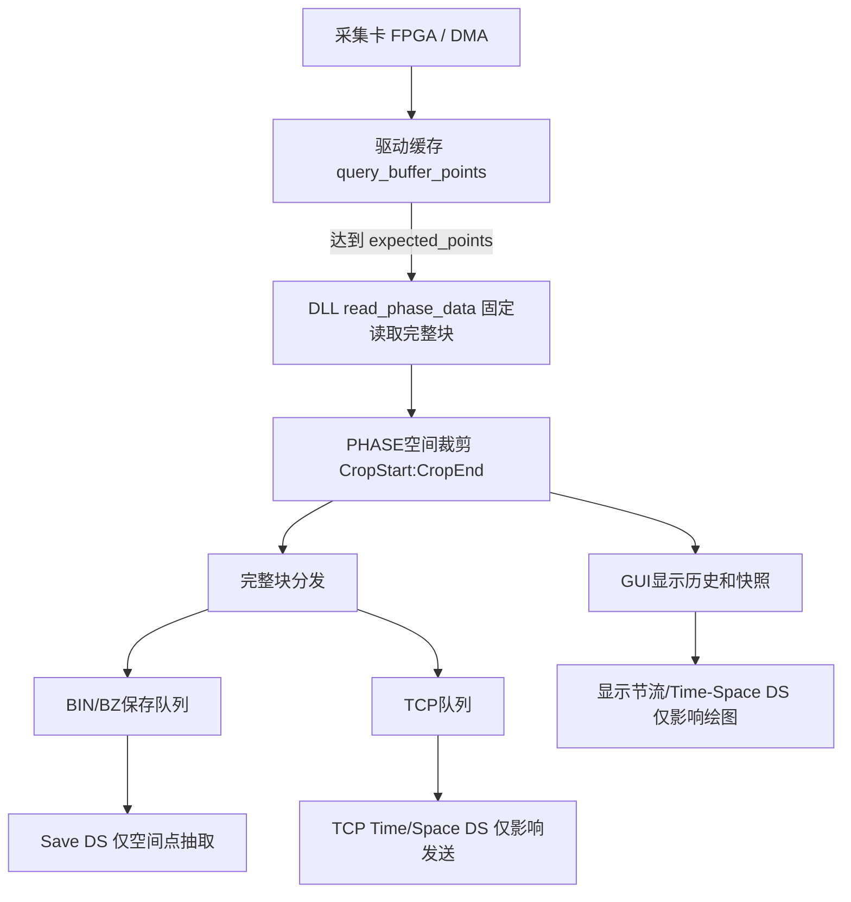

# 100 kHz采样数据量减半日志分析文档

## 1. 文档目的

本文汇总2026-08-14前后多轮现场测试日志，对“软件配置`Scan=100000 Hz`，但实际只有约`50000 frame/s`，每个标称1秒文件约2秒墙钟时间才生成”的问题进行统一分析。

分析目标：

1. 判断是否存在Python/Qt上位机因数据量过大而自动进行时间降采样。
2. 判断BIN、BZ、显示节流、存储队列或缓存轮询是否造成帧数减半。
3. 比较内部/外部时钟、PolarDiv开关、不同Scan以及不同Merge参数的结果。
4. 明确当前能够确认的结论、仍未确认的底层机制和后续验证方法。

## 2. 分析对象

| 日志 | 主要用途 |
| --- | --- |
| `logs/20260814_050253.log` | 首次确认BIN/BZ文件均约每2秒产生100000帧，且无存储时同样约50 kfps |
| `logs/100k_polar_on.log` | `PolarDiv=ON`，包含BIN、BZ和一次BZ压缩异常测试 |
| `logs/100k_polar_off.log` | `PolarDiv=OFF`，包含BIN、BZ稳定测试 |
| `logs/20260814_062847.log` | 内/外时钟及`50/60/70/80/100 kHz`采样率对照 |
| `logs/20260814_064325.log` | `Merge=6`带宽对照，验证减少PHASE点数能否恢复100 kfps |

共同的主要硬件参数为：单通道PHASE、`PointNum=3072`、`Bypass=60`、`DataRate=4 ns`、`Rate2Phase=1`。多数测试使用`Merge=3`，最后一轮使用`Merge=6`。软件参数通常为`Length/Load=0.2 s`、`Length/Plot=0.4 s`、`Length/Save=0.2 s`、`Length/File=1.0 s`。

## 3. 结论摘要

### 3.1 已由代码和日志确认

1. **Python上位机不存在“数据量超过阈值后自动把时间帧减半”的代码路径。**
2. **BIN和BZ保存器没有对时间帧做降采样。** 测试中`save_ds=1`；即使`Save DS>1`，也只抽取每帧内部的空间点，不删除时间帧。
3. **GUI刷新节流只减少绘图次数，不影响保存数据。** 完整采集块先进入存储/TCP，再生成可覆盖的GUI快照。
4. **80/100 kHz减半发生在Python调用`read_phase_data()`之前。** 驱动缓存形成一个“标称0.2秒数据块”已经需要约0.4秒。
5. **ClockSource不是根因。** 50 kHz在内部和外部时钟下都接近50 kfps；100 kHz在内部和外部时钟下都接近50 kfps。
6. **PolarDiv不是根因。** 100 kHz下PolarDiv开、关均约50 kfps。
7. **不是主机PHASE数据吞吐上限。** `70 kHz / Merge3`约286.72 MB/s可以全速运行；`100 kHz / Merge6`理论仅204.80 MB/s，却仍减半。
8. **50/60/70 kHz基本全速，80/100 kHz稳定为配置值的约一半。** 这表现为明显的高频档位边界，而不是随CPU或磁盘负载随机下降。

### 3.2 当前最强推断

当前最符合全部测试结果的解释是：

> `PointNum=3072、Bypass=60、DataRate=4 ns`时，单次扫描窗口接近`12.5 us`；70 kHz周期足够，80 kHz及100 kHz周期不足，采集卡固件/扫描链路可能自动采用隔周期输出，最终每两个扫描周期形成一个完整PHASE帧。

该推断与`70 kHz正常、80 kHz减半、100 kHz减半、Merge减半后100 kHz仍减半`完全一致，但尚未通过厂商固件文档、寄存器回读或示波器触发测量最终确认。

### 3.3 尚不能仅凭Python日志确认

当前可以把问题定位到Python应用以下，但还不能严格区分：

```text
FPGA扫描/PHASE生成
        ↓
DMA和Windows设备驱动
        ↓
pcie7821_api.dll缓存计数与读取语义
        ↓
Python query_buffer_points/read_phase_data
```

因此文档中的准确表述应为“问题位于DLL/驱动/固件链路，强烈倾向扫描时序或固件高频策略”，不应在缺少底层资料时直接断言某一层必然有Bug。

## 4. 测试结果汇总

### 4.1 PolarDiv与存储格式对照

| PolarDiv | 格式 | 采集帧数 | 墙钟时长 | 实际帧率 | 存储结果 |
| --- | ---: | ---: | ---: | ---: | --- |
| ON，第1次 | BZ | 3,040,000 | 61.292 s | 49,598.5 fps | BZ启动异常，丢35块，共700,000帧 |
| ON，第2次 | BIN | 6,220,000 | 124.725 s | 49,869.8 fps | 无丢帧 |
| ON，第3次 | BZ | 7,660,000 | 153.410 s | 49,931.6 fps | 无丢帧 |
| OFF，第1次 | BIN | 6,140,000 | 123.186 s | 49,843.3 fps | 无丢帧 |
| OFF，第2次 | BZ | 11,440,000 | 229.318 s | 49,887.1 fps | 无丢帧 |

结论：稳定段全部约`49.84~49.93 kfps`，与PolarDiv和BIN/BZ格式无关。

第一次Polar ON/BZ测试中的700,000帧丢失是独立的压缩过载事件：压缩单包一度达到约`7.9~9.45 s`，raw和packet队列达到`6/6`。它证明保存器过载时确实会显式丢块并记录`dropped_blocks`，但不能解释其他无丢块测试中稳定存在的50 kfps现象。

### 4.2 不同时钟和采样率对照

| Scan配置 | 时钟 | PolarDiv | 稳定实测帧率 | `fps_ratio` | 标称1秒文件生成间隔 | 判定 |
| ---: | --- | ---: | ---: | ---: | ---: | --- |
| 50 kHz | Internal | ON | 约49.8 kfps | 约0.996 | 约1.00 s | 正常 |
| 50 kHz | External | ON | 约49.5 kfps | 约0.991 | 约1.00 s | 正常 |
| 60 kHz | External | ON | 约59.3 kfps | 约0.988 | 约1.00 s | 正常 |
| 70 kHz | External | ON | 约69.5 kfps | 约0.993 | 约1.00 s | 正常 |
| 80 kHz | External | ON | 约39.8 kfps | 约0.498 | 约2.00 s | 减半 |
| 100 kHz | Internal | OFF | 约49.9 kfps | 约0.499 | 约2.00 s | 减半 |
| 100 kHz | Internal | ON | 约49.8 kfps | 约0.498 | 约2.00 s | 减半 |
| 100 kHz | External | ON/OFF | 约49.9 kfps | 约0.499 | 约2.00 s | 减半 |

该结果排除了“固定除2”：如果所有配置都固定除2，50/60/70 kHz也应分别变成25/30/35 kfps，但实际并非如此。现象更像在70和80 kHz之间跨越某个硬件时序或固件档位边界。

### 4.3 Merge带宽对照

最后一轮将`Merge`从3增大到6，使PHASE每帧点数减半：

```text
Merge3: 3072 / 3 = 1024点/帧
Merge6: 3072 / 6 =  512点/帧
```

| 测试 | Merge | 每批帧数 | DLL每批请求点数 | DLL数据量 | 真实读取间隔p50 | 实测帧率 |
| --- | ---: | ---: | ---: | ---: | ---: | ---: |
| 70 kHz | 6 | 14,000 | 7,168,000 | 28.672 MB | 202.1 ms | 约69.6 kfps |
| 100 kHz | 6 | 20,000 | 10,240,000 | 40.960 MB | 402.2 ms | 约49.9 kfps |

带宽对比：

```text
70 kHz / Merge3全速数据率
= 70000 × 1024 × 4
= 286.72 MB/s

100 kHz / Merge6若全速数据率
= 100000 × 512 × 4
= 204.80 MB/s
```

系统已经能够全速处理更高的`286.72 MB/s`，但较低的`204.80 MB/s`配置仍减半，因此“Python或PCIe因PHASE上传数据量过大而自动降采样”与实测矛盾。

## 5. 软件读取机制

### 5.1 `Length/Load=0.2 s`的真实含义

`Length/Load`不是固定0.2秒定时器。软件用配置采样率换算每批帧数：

```text
frame_load_num = round(length_load_s × configured_scan_rate)
```

| Scan | `frame_load_num` |
| ---: | ---: |
| 50 kHz | 10,000帧 |
| 60 kHz | 12,000帧 |
| 70 kHz | 14,000帧 |
| 80 kHz | 16,000帧 |
| 100 kHz | 20,000帧 |

PHASE模式下等待点数为：

```text
expected_points = points_after_merge × frame_load_num
```

软件持续查询驱动缓存，只有当`points_in_buffer >= expected_points`时才读取固定的`expected_points`。

### 5.2 动态缓存轮询

缓存低水位时计划每10 ms查询一次，达到目标块80%后计划每1 ms查询一次。受Windows定时器和线程调度影响，低频阶段从日志反算的实际平均检查间隔通常约`15~16 ms`。

轮询误差最多通常造成几毫秒到十几毫秒的触发延迟，无法解释标称0.2秒数据块稳定需要约0.4秒才能形成。

### 5.3 真实读取周期

| Scan | 每批帧数 | 相邻DLL读取完成间隔p50 | DLL调用耗时p50 | 解释 |
| ---: | ---: | ---: | ---: | --- |
| 50 kHz | 10,000 | 约202 ms | 约18 ms | 0.2秒数据按时形成 |
| 60 kHz | 12,000 | 约203 ms | 约21 ms | 0.2秒数据按时形成 |
| 70 kHz | 14,000 | 约202 ms | 约24 ms（Merge3）/12.6 ms（Merge6） | 0.2秒数据按时形成 |
| 80 kHz | 16,000 | 约400 ms | 约29 ms | 缓存增长速度约为配置值一半 |
| 100 kHz | 20,000 | 约400 ms | 约35 ms（Merge3）/18.1 ms（Merge6） | 缓存增长速度约为配置值一半 |

每次日志均记录：

```text
Loop N: waiting for <expected_points> points
Buffer ready: <points_in_buffer> points, waited <wait_ms>
Calling api.read_phase_data: points_per_ch=<expected_points>
read_phase_data: requested=<expected_points>, returned=<expected_points>
```

所有测试均满足`requested == returned`，没有发现Python请求完整块但DLL只返回半块的情况。真正的差异发生在`Buffer ready`之前：80/100 kHz下驱动缓存达到目标值需要约两倍时间。

### 5.4 缓存略高于目标时是否丢剩余数据

Python只向DLL请求目标点数，没有清空、复位或停止采集操作。按常规FIFO语义，超出的点应留在驱动缓存，供下一轮读取：

```text
读取前: [目标块][过冲剩余]
读取后:         [过冲剩余] → 下一轮继续读取
```

`Merge=6`日志中，70 kHz每次达到阈值时超出量中位数约504帧，100 kHz约370帧。70 kHz仍能达到约99%的配置帧率，强烈支持超出部分被保留而不是每次清空。

但仓库缺少厂商API手册，无法仅凭Python函数名100%证明DLL的FIFO消费语义。可在DEBUG模式下于读取后立即查询一次缓存，用以下关系做非原子近似验证：

```text
buffer_after
≈ buffer_before - returned_points + read期间新产生的点数
```

## 6. 程序内降采样与丢弃操作审计



| 操作 | 所在维度 | 是否自动按数据量触发 | 是否减少BIN/BZ时间帧 |
| --- | --- | --- | --- |
| `Merge` | FPGA/PHASE空间点 | 否，用户参数 | 否 |
| PHASE Crop | 每帧空间点 | 否，用户参数 | 否，只改变每帧宽度 |
| `Save DS` | 每帧空间点 | 否，用户参数 | 否；本轮均为1 |
| Time-Space Time DS | 显示时间帧 | 否，用户参数 | 否 |
| Time-Space Space DS | 显示空间点 | 否，用户参数 | 否 |
| TCP Time/Space DS | 网络发送数据 | 否，用户参数 | 否 |
| GUI刷新节流 | GUI快照 | 按显示节拍 | 否，完整块已先进入存储 |
| 保存队列满 | 完整采集块 | 仅过载时 | 会丢，但有明确告警和`dropped_blocks`计数 |

正常测试最终均满足：

```text
frames_received == frames_written
pending_frames = 0
continuity_gap = 0
dropped_blocks = 0
storage_downsample_space_only = 1
```

因此这些测试证明：驱动交给应用的帧全部写入文件。它们不能证明采集卡在每个配置扫描周期都产生了一个PHASE帧，因为80/100 kHz的减半已经发生在应用可见缓存之前。

## 7. 扫描时序边界推断

当前`DataRate=4 ns`，若该参数确实代表每个原始采样点占用4 ns，则单次扫描窗口估算为：

```text
仅PointNum:
3072 × 4 ns = 12.288 us

若Bypass也占用扫描窗口:
(3072 + 60) × 4 ns = 12.528 us

再计入20 ns脉宽:
12.528 us + 0.020 us = 12.548 us

对应频率:
1 / 12.548 us ≈ 79.69 kHz
```

不同Scan周期：

| Scan | 扫描周期 | 与约12.55 us窗口的关系 | 实测 |
| ---: | ---: | --- | --- |
| 70 kHz | 14.286 us | 可容纳 | 约70 kfps |
| 80 kHz | 12.500 us | 略短，临界越界 | 约40 kfps |
| 100 kHz | 10.000 us | 无法容纳 | 约50 kfps |

Merge位于后端PHASE空间合并阶段。将Merge从3改到6可以减少上传点数，但不会减少前端一次扫描仍需覆盖的3072个原始采样点。因此“Merge6不能恢复100 kfps”进一步支持扫描窗口限制。

重要限制：以上是依据当前代码对`DataRate`的定义和实测边界做出的强推断，必须由厂商确认`PointNum`、`Bypass`、`DataRate`和`PulseWidth`在固件中的准确时序关系。

## 8. 文件时间与真实时间

文件名中的`100000Hz`和BZ头中的`scan_rate_hz`目前记录的是配置值，不是实测值。

在100 kHz减半条件下：

```text
每个文件帧数 = 100000帧
实际输出帧率 ≈ 50000帧/秒
实际生成时间 ≈ 2秒
```

因此“文件包含100000帧”只能证明按帧数切分正确，不能证明文件覆盖1秒真实墙钟时间。同理，显示时间轴使用配置100 kHz计算时会比真实墙钟快约一倍。

## 9. 软件侧仍应改进的问题

这些问题不是本次减半的根因，但会影响诊断准确性：

1. `read_phase_data()`当前按请求点数构造NumPy视图，而不是按`points_returned`截取。当前日志中两者始终相等，未造成问题；以后若DLL短读，可能把缓冲尾部旧数据交给上层。
2. `frames_acquired`在一次读取结束后固定增加`frame_load_num`。应在短读情况下按完整返回帧数计数，或直接拒绝不完整块。
3. `Slow loop iteration`使用配置帧率计算`expected_block=200 ms`。100 kHz实际减半后会每块都告警，文字容易被误解为Python处理慢。
4. 当前低帧率告警仍提示检查PolarDiv，但A/B测试已经排除PolarDiv，应改为提示扫描窗口、PointNum、DataRate、固件分频和DLL/驱动限制。
5. `continuity_gap=0`只表示保存器已接收的数据全部写完。完整性结论还必须同时检查`acquisition_frames == frames_received`和`dropped_blocks == 0`。
6. 文件元数据应同时保存`configured_scan_rate`和运行稳定后的`measured_output_fps`，避免把配置值误当真实时间基准。

## 10. 后续建议

### 10.1 最小硬件参数测试矩阵

优先执行以下测试，每组15~30秒，使用BIN并保持其他参数一致：

| 优先级 | Scan | PointNum | DataRate | Merge | 目的与判据 |
| ---: | ---: | ---: | ---: | ---: | --- |
| 1 | 100 kHz | 2048 | 4 ns | 6 | 若恢复约100 kfps，确认限制与单次扫描窗口/原始点数相关 |
| 2 | 100 kHz | 3072 | 2 ns | 6 | 若恢复约100 kfps，确认限制与DataRate对应的扫描时长相关 |
| 3 | 75 kHz | 3072 | 4 ns | 6 | 验证临界点以下正常 |
| 4 | 78 kHz | 3072 | 4 ns | 6 | 缩小边界范围 |
| 5 | 79 kHz | 3072 | 4 ns | 6 | 验证约79.7 kHz推断 |
| 6 | 80 kHz | 3072 | 4 ns | 6 | 已知减半，作为边界对照 |

不建议继续只修改Merge做更多100 kHz测试；Merge3和Merge6已经足以说明减少后端PHASE数据量不能恢复帧率。

### 10.2 外部测量

使用示波器测量`TriggerDirection.OUTPUT`的真实输出频率：

| 100 kHz配置下的测量结果 | 判断 |
| --- | --- |
| 触发输出约50 kHz | 固件扫描发生器或时序限制已经把实际扫描降为50 kHz |
| 触发输出约100 kHz，但PHASE约50 kfps | 减半发生在PHASE生成、DMA、驱动或DLL链路 |

### 10.3 厂商最小程序

使用厂商C/C++示例，仅执行：

```text
配置参数
→ start
→ query point count
→ 达到目标后read
→ 统计单位时间returned points
```

若最小程序仍为50 kfps，可完全排除本项目Python/Qt逻辑。向厂商提供本文件中的参数和边界结果，并要求确认：

1. `DataRate`的精确定义。
2. `PointNum + Bypass + PulseWidth`的最小扫描周期公式。
3. 超出最高扫描率时固件是否自动隔周期或二分频。
4. `pcie7821_read_phase_data`是否仅消费请求点数并保留FIFO剩余数据。
5. 是否存在读取实际Scan寄存器、FPGA版本和驱动/DLL版本的API。

### 10.4 建议增加的诊断日志

DEBUG模式下每10~20块记录一次读取前后缓存：

```text
buffer_before
requested_points
returned_points
buffer_after
estimated_generated_during_read
```

该日志可以验证FIFO剩余数据是否保留，但不宜长期每块查询，以免额外DLL调用改变被测时序。

## 11. 最终判定标准

问题关闭前至少应满足以下一项：

1. 厂商文档确认当前参数组合的最高有效Scan约为80 kHz，并说明超过边界后的分频规则；或
2. `PointNum=2048`或`DataRate=2 ns`时100 kHz实测恢复至95 kfps以上，验证扫描窗口推断；或
3. 厂商最小程序与本软件得到相同的50 kfps结果，确认问题不在Python应用；或
4. 找到底层DLL/驱动参数错误，并在修复后满足：读取周期约200 ms、文件间隔约1秒、`fps_ratio >= 0.95`且全链路无丢块。

在底层原因确认前，应将80/100 kHz文件和图形中的时间解释标记为“配置时间基准”，真实持续时间以`measured_output_fps`或文件名墙钟时间校准。
