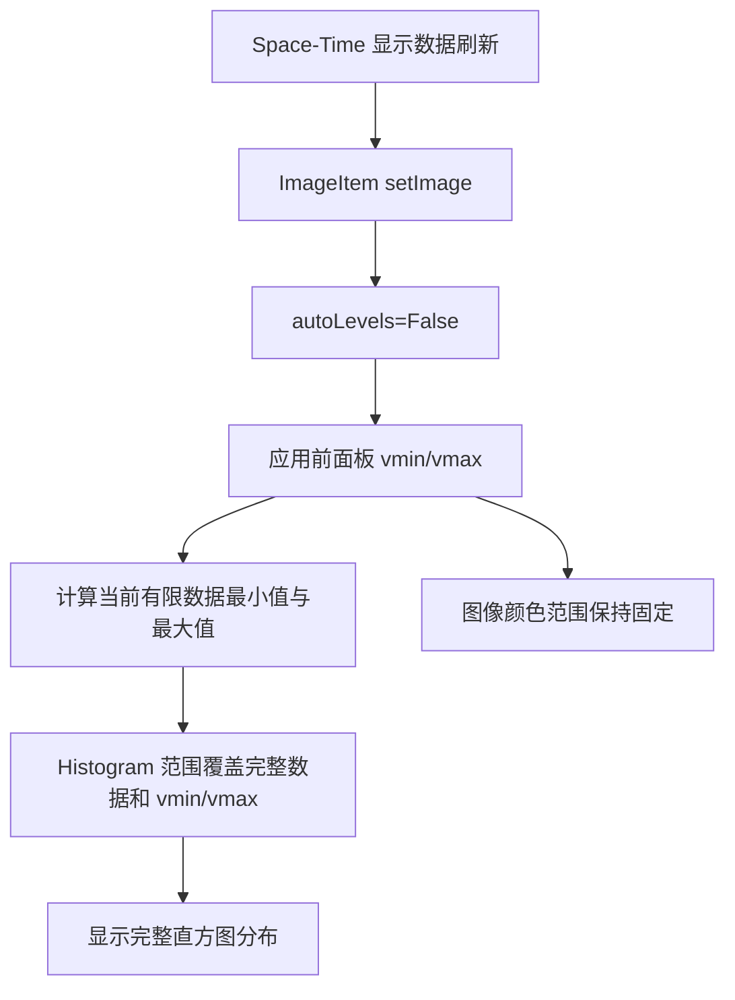

# Space-Time 颜色条显示优化

## 1. 问题背景

当前项目的 Space-Time 图使用 `pyqtgraph.HistogramLUTWidget` 同时显示颜色映射梯度、颜色 levels 和数据直方图。前一轮修改已经解决了颜色范围在图像更新时自动变化的问题，前面板中的 `vmin` 和 `vmax` 可以稳定控制图像着色范围。但是实际使用中仍存在两个明显的显示问题：颜色条整体过窄，刻度与数据直方图区域拥挤；直方图显示范围被强制限制在 `vmin` 与 `vmax` 之间，超出颜色映射范围的数据分布无法完整显示。

本次优化参考项目：

```text
E:\codes\das_fs_7825\pcie7825_gui
```

重点比较参考项目和当前项目的 `src/time_space_plot.py`，分析 `HistogramLUTWidget` 的尺寸、背景、坐标轴字体、gradient 字体、图像绑定方式以及直方图显示范围处理方式，并在不破坏前面板固定颜色范围功能的前提下优化当前实现。

## 2. 优化前存在的问题

### 2.1 颜色条宽度不足

优化前，当前项目使用固定宽度：

```python
self.histogram_widget.setFixedWidth(90)
```

`90 px` 需要同时容纳数据直方图、颜色梯度、levels 区域和数值刻度。实际界面中，数据分布曲线显示区域较窄，刻度文字和梯度区域也比较拥挤，颜色条的视觉比例与主图不协调。

参考项目没有把颜色条固定为单一窄宽度，而是设置：

```python
self.histogram_widget.setMinimumWidth(120)
self.histogram_widget.setMaximumWidth(150)
```

这种方式为直方图和刻度保留了更多空间，同时允许布局在窗口尺寸变化时进行有限调整。

### 2.2 数据直方图分布显示不全

前一轮为了确保前面板 `vmin` 和 `vmax` 生效，在 `_apply_color_levels()` 中同时执行了：

```python
self.histogram_widget.setLevels(self._vmin, self._vmax)
histogram_item.setHistogramRange(self._vmin, self._vmax, padding=0.0)
```

`setLevels()` 用于控制颜色映射范围，是必要操作。图像值小于 `vmin` 时映射到最低颜色，大于 `vmax` 时映射到最高颜色。

但是，`setHistogramRange()` 控制的是 Histogram 图的可视范围，而不是图像着色范围。把它同样固定为 `vmin` 和 `vmax` 后，所有超出颜色 levels 的数据分布都会被直方图视野裁掉。例如实际数据范围为：

$$
[-0.15,\ 0.18]
$$

前面板颜色范围为：

$$
[v_{\min},\ v_{\max}]
=
[-0.02,\ 0.02]
$$

优化前直方图只显示 $[-0.02,\ 0.02]$，无法观察数据在颜色范围之外的分布情况。这会让用户误以为数据全部集中在前面板范围内，也不利于判断 `vmin` 和 `vmax` 是否设置合理。

### 2.3 样式设置不够完整

当前项目只设置了 Histogram 左侧坐标轴的字体和颜色，没有对 gradient 刻度字体进行设置，也没有在 `pyqtgraph` 子组件创建完成后再次应用样式。不同 PyQtGraph 或 Qt 版本中，部分内部组件可能在初始化后延迟创建，导致一次性样式设置不能稳定覆盖全部子项。

参考项目会立即执行一次颜色条样式设置，并通过 `QTimer.singleShot()` 延迟再次设置，从而确保白色背景、黑色刻度轴和 gradient 字体稳定生效。

## 3. 两个项目颜色条实现对比

| 对比项 | 当前项目优化前 | 参考项目 | 当前项目优化后 |
|---|---|---|---|
| 颜色条宽度 | 固定 `90 px` | 最小 `120 px`，最大 `150 px` | 最小 `140 px`，最大 `180 px` |
| 布局间距 | 使用默认间距 | 显式设置约 `5 px` | 显式设置 `6 px` |
| 背景 | 初始化时设置白色 | 初始化和延迟阶段重复设置白色 | 初始化和延迟阶段重复设置白色 |
| Histogram 刻度字体 | Times New Roman `8 pt` | Times New Roman `8 pt` | Times New Roman `8 pt` |
| Gradient 刻度字体 | 未显式设置 | Times New Roman `7 pt` | Times New Roman `7 pt` |
| 图像绑定 | 只在创建时绑定 | 只在创建时绑定 | 只在创建时绑定 |
| 颜色 levels | 前面板 `vmin/vmax` 固定 | 图像更新时设置 levels | 前面板 `vmin/vmax` 固定 |
| Histogram 显示范围 | 强制等于 `vmin/vmax` | 未强制裁剪 | 根据实际数据范围更新，并至少覆盖 `vmin/vmax` |
| levels 拖动 | 禁止 | 可由默认组件行为决定 | 禁止，前面板是唯一控制入口 |

当前项目优化后没有直接照搬参考项目的所有行为。参考项目的颜色条宽度和样式处理值得采用，但当前项目已经明确要求 `vmin` 和 `vmax` 必须由前面板控制，因此继续保留不可拖动 levels 和 `autoLevels=False`。本次只借鉴参考项目的视觉布局与样式稳定化方法，并重新设计直方图可视范围。

## 4. 优化方案

### 4.1 加宽颜色条

颜色条宽度修改为：

```python
self.histogram_widget.setMinimumWidth(140)
self.histogram_widget.setMaximumWidth(180)
```

相比参考项目的 `120–150 px`，当前项目进一步增加宽度，为数据分布曲线、颜色梯度和六位小数颜色范围对应的刻度文字留出空间。主图仍使用 stretch factor `1`，颜色条使用 stretch factor `0`，因此窗口扩展时主要空间仍分配给 Space-Time 主图。

主图与颜色条之间的布局边距和间距显式设置为：

```python
plot_layout.setContentsMargins(0, 0, 0, 0)
plot_layout.setSpacing(6)
```

这样可以避免不同平台默认布局间距造成颜色条与主图距离不一致。

### 4.2 分离颜色映射范围和直方图显示范围

优化后的逻辑明确区分两个概念：

1. 颜色映射范围由前面板 `vmin` 和 `vmax` 决定。
2. 直方图显示范围用于展示实际数据分布。

图像着色仍然使用：

```python
self.image_item.setLevels((self._vmin, self._vmax))
self.histogram_widget.setLevels(self._vmin, self._vmax)
```

直方图显示范围则根据当前显示数据计算：

$$
H_{\min}
=
\min(D_{\min}, v_{\min})
$$

$$
H_{\max}
=
\max(D_{\max}, v_{\max})
$$

其中，$D_{\min}$ 和 $D_{\max}$ 是当前 Space-Time 显示数据中的最小值和最大值。这样既能显示完整数据分布，又保证直方图视野始终包含前面板设定的颜色 levels。

更新直方图范围时增加 `5%` padding，避免最小值和最大值紧贴边缘：

```python
histogram_item.setHistogramRange(
    histogram_min,
    histogram_max,
    padding=0.05,
)
```

对于包含 `NaN` 或无穷值的数据，程序只使用有限值计算范围。如果当前数据中不存在有限值，则退回使用 `vmin` 和 `vmax`。

### 4.3 保持前面板颜色范围的唯一控制权

本次修改没有恢复 Histogram 自动 levels，也没有重新允许拖动颜色 levels。当前行为仍然是：

- `ImageItem.setImage(..., autoLevels=False)` 禁止图像自动调整颜色范围。
- `HistogramLUTWidget.setImageItem()` 只在创建时调用一次。
- Histogram region 保持不可拖动。
- 前面板 `vmin` 和 `vmax` 是颜色映射范围的唯一控制入口。

因此，直方图可以显示超出颜色 levels 的完整数据分布，但图像颜色不会随数据最小值和最大值自动变化。

### 4.4 稳定颜色条样式

新增 `_style_histogram_widget()`，统一设置：

- Histogram 白色背景。
- 左侧坐标轴 Times New Roman `8 pt` 字体。
- 黑色轴线和黑色刻度文字。
- 显示坐标轴数值。
- Gradient Times New Roman `7 pt` 刻度字体。

样式方法在创建颜色条时立即执行一次，并在约 $100\ \mathrm{ms}$ 后通过 `QTimer.singleShot()` 再执行一次。延迟执行用于覆盖 PyQtGraph 内部子组件完成初始化后的最终状态。

## 5. 优化后的更新流程



该流程中，颜色映射和数据分布显示相互独立。用户可以使用固定的颜色范围比较不同时刻的数据，同时从直方图中观察是否存在大量超出颜色范围的数据。

## 6. 预期效果

优化后，Space-Time 颜色条应具备以下表现：

1. 颜色条宽度明显增加，数据分布曲线、gradient 和数值刻度不再拥挤。
2. 实际数据超出 `vmin/vmax` 时，直方图仍能显示超出部分的数据分布。
3. 前面板修改 `vmin/vmax` 后，图像颜色范围立即生效。
4. Space-Time 数据持续更新时，图像颜色范围不会自动变化。
5. 颜色条背景、刻度轴和 gradient 字体在不同初始化时序下保持一致。
6. 主图仍获得主要布局空间，颜色条加宽不会改变 Space-Time 数据处理逻辑。

## 7. 涉及代码

本次修改集中在：

```text
src/time_space_plot.py
```

主要涉及：

- `_setup_ui()`：设置主图与颜色条布局间距。
- `_create_colorbar()`：扩大颜色条宽度并安排即时与延迟样式设置。
- `_style_histogram_widget()`：统一颜色条视觉样式。
- `_apply_color_levels()`：仅应用颜色映射 levels，不再裁剪直方图显示范围。
- `_update_histogram_range()`：根据实际数据范围更新直方图视野。
- `_update_display()`：每次显示刷新后更新完整数据分布范围。

## 8. 验证重点

现场 GUI 验证时建议覆盖以下场景：

1. 将 `vmin/vmax` 设置为明显小于实际数据范围的区间，确认直方图仍显示完整数据分布，而图像颜色保持前面板范围。
2. 连续更新 Space-Time 数据，确认 `vmin/vmax` 不自动变化。
3. 切换 Jet、Viridis、Plasma、Seismic 和 Gray 等 colormap，确认主图与颜色条 gradient 同步。
4. 调整窗口宽度，确认颜色条在 `140–180 px` 范围内显示，主图仍能正常扩展。
5. 检查白色背景、黑色数值刻度和 gradient 字体是否完整显示。
6. 使用包含异常值或 `NaN` 的测试数据，确认直方图范围计算不会导致界面异常。

本次修改只改变颜色条的布局、样式和数据分布显示范围，不改变 Space-Time 数据缓冲、降采样、坐标映射、前面板参数持久化或采集数据通路。
