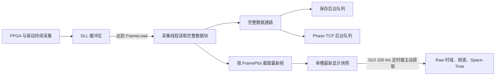

# Raw Data 时域绘图卡顿问题解决

## 1. 文档目的

本文记录单通道 Raw 数据采集过程中，时域波形更新卡顿、界面显示滞后以及点击 STOP 后需要等待较长时间才能停止的问题分析、代码优化和验证结果。分析主要依据 `logs/log--20260606-1.txt`、`logs/log--20260606-2.txt` 以及当前版本中的 `src/acquisition_thread.py`、`src/main_window.py`、`src/config.py`、`src/time_space_plot.py` 和 `src/data_saver.py`。

本次问题不能简单归结为“绘图速度慢”。日志和代码表明，卡顿由两个不同层级的问题叠加形成。第一层是 GUI 数据通路问题：采集线程将完整 Raw 大数组持续发送到 Qt 主线程，造成历史回调和绘图事件积压。第二层是底层读取性能问题：部分采集轮次中 DLL 读取耗时明显超过数据块产生周期，驱动缓冲区持续增长。前者可以通过上位机数据流重构解决，后者仍需要通过 `FrameLoad` 调整、驱动状态检查和底层接口优化继续处理。

## 2. 问题参数与数据规模

出现明显卡顿时使用的主要参数如下：

```text
ScanRate = 2000
Points = 20480
Channels = 1
DataSource = Raw
FrameLoad = 1024
FramePlot = 1024
```

Raw 数据由 DLL 以 `int16` 返回，每点占用 $2$ 字节。因此，一个完整 `FrameLoad` 数据块的内存大小为：

$$
B_{\mathrm{raw}} =
\mathrm{Points}
\times
\mathrm{FrameLoad}
\times
\mathrm{Channels}
\times
2
$$

代入测试参数：

$$
B_{\mathrm{raw}} =
20480
\times
1024
\times
1
\times
2
=
41943040\ \mathrm{bytes}
=
40\ \mathrm{MiB}
$$

一个数据块覆盖的采集时间为：

$$
T_{\mathrm{block}} =
\frac{\mathrm{FrameLoad}}{\mathrm{ScanRate}}
=
\frac{1024}{2000}
=
0.512\ \mathrm{s}
$$

对应的持续 Raw 数据率约为：

$$
R_{\mathrm{raw}} =
\frac{40\ \mathrm{MiB}}{0.512\ \mathrm{s}}
=
78.125\ \mathrm{MiB/s}
$$

这意味着采集线程约每 $512\ \mathrm{ms}$ 就需要读取并分发一个 $40\ \mathrm{MiB}$ 数组。如果完整数组进入 GUI 事件队列，而 GUI 对单个数组的处理时间接近或超过数据块到达间隔，历史任务就会不断积压。

## 3. 原始现象

现场表现主要包括以下几类：

1. Raw 时域波形不是连续流畅地显示最新数据，而是长时间不更新或间歇性跳动。
2. 终端日志持续输出，说明采集线程或其他后台线程仍在运行，但 GUI 对用户操作响应迟缓。
3. 点击 STOP 后，硬件停止和采集线程退出可能已经发生，但按钮和界面需要等待数秒才恢复。
4. 在较大 `Points` 或 `FrameLoad` 配置下，底层驱动缓冲区点数持续增长，单次 DLL 读取耗时明显增加。

这些现象容易让人误以为 STOP 调用本身阻塞，或者认为终端持续打印日志就表示采集线程没有停止。实际日志表明，原始版本中用户感知到的 STOP 延迟主要来自 Qt 主线程事件队列积压，而不是硬件停止接口本身。

## 4. 根因分析

### 4.1 完整 Raw 大数组进入 Qt 主线程队列

优化前，采集线程每读取一个完整数据块，就通过 Qt 信号把完整数组发送到 GUI 主线程。对于本次参数，每次信号携带约 $40\ \mathrm{MiB}$ 数据。虽然时域图最终可能只绘制少量曲线，完整数组仍然需要进入 GUI 事件队列并等待主线程处理。

原有逻辑曾尝试通过固定时间间隔限制信号发送频率，但当单次 DLL 读取耗时本身已经超过节流间隔时，几乎每个读取块仍会触发一次 GUI 信号。因此，固定节流不能阻止完整大数组进入 Qt 队列。

当 GUI 处理速度低于采集线程发送速度时，队列中会同时存在历史 Raw 数据回调、绘图任务、状态更新事件和 STOP 信号。Qt 主线程按照事件队列顺序处理这些任务，因此用户点击 STOP 后，停止相关事件需要等待前面的历史 Raw 回调完成，形成数秒级界面延迟。

### 4.2 显示需求与完整数据需求没有分离

保存和 TCP 发送要求使用完整采集数据，但实时显示只需要有限数量的最新帧。原始数据流没有区分这两类需求，导致 GUI 被迫接收完整 `FrameLoad` 数据块。

`FrameLoad` 和 `FramePlot` 的职责不同：

- `FrameLoad` 决定采集线程每次从 DLL 缓冲区批量读取多少帧。
- `FramePlot` 决定 GUI 每次显示最多使用多少帧。

如果把完整 `FrameLoad` 数组直接发送给 GUI，即使用户把 `FramePlot` 调小，也无法从根本上阻止 Qt 事件队列接收大数组。必须在采集线程中先按 `FramePlot` 截取显示快照，再把完整数据和显示数据送入不同通路。

### 4.3 DLL 和驱动读取耗时超过数据块产生周期

GUI 队列积压不是唯一问题。日志显示，在相同参数下，不同启动轮次的 Raw DLL 读取性能差异很大。对于 `Points=20480`、`FrameLoad=1024` 的 $40\ \mathrm{MiB}$ 数据块，部分轮次单次读取约为几十毫秒，但另一些轮次的中位读取耗时达到约 $2.05$ 至 $2.32\ \mathrm{s}$，最大值超过 $3.4\ \mathrm{s}$。

当读取时间满足：

$$
T_{\mathrm{read}} > T_{\mathrm{block}}
$$

采集线程消费数据的速度低于硬件产生数据的速度，驱动缓冲区会持续增长。此时，即使 GUI 显示链路已经优化，底层仍可能出现读取延迟、缓冲积压和停止等待。该问题更可能与 DLL、驱动内部缓冲区状态、重复启动后的状态清理或单块读取规模有关，不能仅靠绘图优化解决。

对于 `Points=51200`、`FrameLoad=1024` 的 Raw 数据，单块达到 $100\ \mathrm{MiB}$，持续数据率约为：

$$
\frac{100\ \mathrm{MiB}}{0.512\ \mathrm{s}}
\approx
195.3\ \mathrm{MiB/s}
$$

日志中该配置的单次读取最长超过 $9\ \mathrm{s}$，说明它不适合作为当前软硬件条件下的长期稳定配置。

## 5. 核心解决方案

### 5.1 将完整数据通路与显示通路解耦

当前程序把采集后的完整数据和 GUI 显示数据拆分为两条独立通路。采集线程读取完整数据块后，直接调用非 GUI 的完整数据处理器。完整数据进入保存队列，Phase 数据还可以进入 TCP 后台发送队列。完整数据不再作为 Qt 大数组信号进入 GUI 主线程。

显示侧由采集线程根据 `FramePlot` 从完整数据块中截取最新帧，并复制为独立、连续的 NumPy 数组。该数组只用于时域波形、频谱和 Space-Time 等显示处理。



这种结构保留了完整数据保存能力，同时避免 GUI 主线程承担完整 Raw 大数组的排队、复制和释放压力。

### 5.2 使用单槽最新显示快照

显示快照不是普通先进先出队列，而是一个最多保存一份数据的可覆盖槽位。如果 GUI 尚未消费上一份快照，新的快照会直接替换旧快照，并增加 `gui_skips` 计数。

该策略明确接受“实时显示可以跳过历史帧”，以换取“界面始终尽快显示最新状态”。对于监控型上位机，显示最新数据通常比完整播放历史画面更重要。完整数据保存使用独立后台通路，不受显示跳帧影响。

GUI 使用约 $100\ \mathrm{ms}$ 周期的定时器，每次最多取走一个最新快照。无论采集线程在此期间产生多少个显示快照，GUI 都不会形成无上限历史数据队列。

### 5.3 限制显示数据量

采集线程创建显示快照时使用：

$$
\mathrm{DisplayFrames}
=
\min(\mathrm{FramePlot}, \mathrm{FrameLoad})
$$

当 `FramePlot < FrameLoad` 时，采集线程仍读取和保存完整数据块，但 GUI 只接收最新的 `FramePlot` 帧。例如：

```text
FrameLoad = 1024
FramePlot = 64
```

DLL 每次仍读取 $1024$ 帧，保存通路仍接收完整 $1024$ 帧，但 GUI 只处理最新 $64$ 帧。这样可以显著降低时域绘图、频谱计算和显示侧内存复制压力。

### 5.4 优化 STOP 流程

当前 STOP 流程首先恢复界面控件状态并请求采集线程停止，然后停止硬件并等待采集线程退出。停止过程中会断开完整数据处理器并清除尚未消费的最新显示快照，从而避免停止后继续处理历史显示数据。

停止信号处理还会检查信号来源。如果旧采集线程的停止信号延迟到达，而用户已经启动了新采集线程，该旧信号会被忽略，不会错误地修改新采集任务的界面状态。

程序停止后会清除当前采集线程引用，状态定时器不会继续打印已经停止线程的诊断快照。终端中仍然出现日志时，应根据日志模块判断它来自保存、TCP、系统状态还是其他线程，而不能仅凭终端仍有输出认定采集没有停止。

### 5.5 使用底层成功读取时间判断停滞

原停滞检测容易受到 GUI 回调延迟影响。GUI 主线程繁忙时，即使采集线程仍在正常读取数据，主界面也可能因为没有及时执行显示回调而误判采集停滞。

当前程序使用采集线程最近一次成功读取数据的时间作为停滞判断依据。诊断字段 `read_age_s` 表示距离最近一次成功读取已经过去的时间。这样可以区分“GUI 没有及时显示”和“底层确实没有读到数据”。

### 5.6 动态慢循环告警阈值

采集循环需要等待一个完整 `FrameLoad` 数据块形成，因此正常循环时间本身与 `FrameLoad` 有关。旧逻辑固定在循环超过 $100\ \mathrm{ms}$ 时记录慢循环告警，会把较大 `FrameLoad` 下的正常等待误判为异常。

当前慢循环告警阈值为：

$$
T_{\mathrm{warning}}
=
\max
\left(
100\ \mathrm{ms},
1.5 \times T_{\mathrm{block}}
\right)
$$

该阈值只影响诊断日志，不改变采集和保存数据，但可以减少无效告警，使真正异常的 `read_ms`、`query_ms` 和缓冲区增长更容易被识别。

## 6. Space-Time 与其他显示侧优化

虽然本次主要问题是 Raw 时域波形卡顿，但同一 GUI 主线程还承担频谱和 Space-Time 更新，因此这些显示逻辑也需要避免无意义开销。

Space-Time 图更新时不再重复调用 `HistogramLUTWidget.setImageItem()`，图像更新使用 `autoLevels=False`，颜色范围由前面板 `vmin` 和 `vmax` 唯一控制。颜色条不会在每次数据刷新时自动调整范围。显示缓冲区填满后，程序直接使用完整连续缓冲区，减少不必要的数据复制。

Phase 显示弧度转换由完整 `float64` 表达式改为 `float32` 原位乘法，减少显示侧临时数组和内存带宽占用。该优化不改变 Raw 时域数据，也不改变保存数据。

## 7. 优化后的日志结果

最新测试日志表明，上位机 GUI 数据通路优化已经生效：

- Raw GUI 回调通常约为 $2$ 至 $4\ \mathrm{ms}$。
- GUI 来不及处理显示快照时，`gui_skips` 增长，说明旧快照被覆盖，而不是进入无上限队列。
- 可测量的多次停止过程显示，采集线程停止延迟约为数毫秒至一百多毫秒。
- 不再出现停止信号被大量历史 Raw GUI 回调拖延数秒的典型现象。
- 正常磁盘状态下，保存队列保持稳定，`save_dropped` 为零。

这些结果说明“波形更新卡顿和 STOP 延迟”中的 GUI 队列积压问题已经得到解决。当前仍需重点关注的是 Raw DLL/驱动读取耗时不稳定和驱动缓冲区增长。

## 8. 参数调整建议

### 8.1 FrameLoad 调整

`FrameLoad` 是上位机每次从 DLL 缓冲区读取的帧数，不是直接下发到 FPGA 的硬件采集参数。降低 `FrameLoad` 会减小单次读取块和单次阻塞时间，但会增加 DLL 调用频率。调整目标是在单次调用开销和大块读取风险之间取得平衡。

对于 `ScanRate=2000`、`Points=20480`、单通道 Raw 数据，建议从以下配置开始测试：

```text
FrameLoad = 128 或 256
FramePlot = 4、16、32 或 64
```

`FrameLoad=128` 时，单块 Raw 数据约为 $5\ \mathrm{MiB}$，对应采集周期为：

$$
\frac{128}{2000}
=
64\ \mathrm{ms}
$$

`FrameLoad=256` 时，单块 Raw 数据约为 $10\ \mathrm{MiB}$，对应采集周期为：

$$
\frac{256}{2000}
=
128\ \mathrm{ms}
$$

应通过日志确认单次读取耗时明显小于对应的数据块周期，且驱动缓冲区点数没有持续单调增长。如果减小 `FrameLoad` 后 DLL 调用开销明显增加或读取更加不稳定，应逐步提高到更合适的值，而不是固定使用最小值。

### 8.2 FramePlot 调整

`FramePlot` 只控制显示侧最多使用的最新帧数，不改变采集卡持续产生的数据率，也不改变每个 `FrameLoad` 完整块的保存数据量。Raw 时域监控通常不需要显示 $1024$ 帧，可以优先减小 `FramePlot`。

当前架构要求：

$$
1
\leq
\mathrm{FramePlot}
\leq
\mathrm{FrameLoad}
$$

如果减小 `FramePlot` 后 GUI 明显流畅，但 `read_ms` 和驱动缓冲区仍持续增长，说明 GUI 压力已经降低，剩余瓶颈位于 DLL、驱动或硬件数据搬运链路。

## 9. 现场验证方法

现场测试不应只观察波形是否“看起来流畅”，还应结合日志字段判断各层状态。建议重点记录以下字段：

- `read_ms`：单次 DLL 数据读取耗时。
- `query_ms`：查询驱动缓冲区点数的耗时。
- `buffer`：当前驱动缓冲区点数与本次期望读取点数。
- `read_age_s`：距离最近一次成功读取数据的时间。
- `gui_skips`：GUI 未消费前被新快照覆盖的次数。
- `save_queue`、`save_max_queue` 和 `save_dropped`：保存队列状态。
- STOP 前后的时间戳和 `thread_stopped` 状态。

判断标准如下：

1. `read_ms` 应长期明显小于 $T_{\mathrm{block}}$。
2. 驱动缓冲区点数不应长期单调增长。
3. `gui_skips` 可以增长，它表示显示主动跳过旧快照，不等同于完整数据丢失。
4. Raw GUI 回调应保持毫秒级，不应随着运行时间持续增长。
5. 点击 STOP 后，采集线程应在合理时间内退出，GUI 不应继续处理大量历史 Raw 回调。
6. 应使用相同参数执行多轮 STOP/START，比较不同启动轮次的 `read_ms`，以识别驱动状态未清理问题。

## 10. 当前存储逻辑边界

当前存储实现已经恢复为分析 `log--20260606-2.txt` 之前的行为。保存线程遇到磁盘写满或其他写入异常时，只记录 `DataSaver error`，随后继续消费保存队列并尝试写入后续数据。保存线程不会进入暂停状态，不会主动创建恢复文件，也不会创建递增编号的 `0 KB` 文件。

当前保存器会把非 `int32` 数据转换为 `int32` 后写盘，因此 Raw `int16` 数据保存时会扩大为 `int32`。这一行为会增加 Raw 保存带宽和磁盘占用。磁盘空间不足会进一步加剧保存错误和系统 I/O 压力，因此进行 Raw 长时间测试前必须确认磁盘空间和持续写入能力。

存储逻辑与 GUI 最新快照显示通路相互独立。显示侧 `gui_skips` 增长不会直接导致保存数据丢失，但保存队列满、磁盘写入失败或底层采集读取失败仍会影响完整数据保存。

## 11. 尚未完全解决的问题

经过本次优化，GUI 历史大数组积压导致的时域卡顿和 STOP 延迟已经得到解决，但以下问题仍需要继续处理：

1. 相同 Raw 参数在不同启动轮次中可能出现明显不同的 DLL 读取性能。
2. 驱动缓冲区在读取性能不足时可能增长到非常大的点数。
3. 大 `Points`、大 `FrameLoad` 的 Raw 配置持续数据率过高，可能超过当前驱动、内存复制或磁盘能力。
4. 需要确认设备 STOP 后，DLL 或驱动内部缓冲区是否真正清空。
5. 当前磁盘写满后会持续记录保存错误，没有磁盘不足预警和可靠恢复确认。
6. Raw 保存统一转换为 `int32`，会使保存带宽和文件大小扩大一倍。

因此，本次解决方案的准确结论是：**上位机 GUI 不再因为完整 Raw 大数组进入 Qt 事件队列而不断积压，实时显示和 STOP 响应得到明显改善；底层 Raw DLL/驱动读取不稳定仍是后续稳定性优化的重点。**

## 12. 涉及代码

本次卡顿问题解决涉及的主要代码位置如下：

- `src/acquisition_thread.py`：完整数据处理器、单槽最新显示快照、显示跳过计数、底层读取诊断、动态慢循环阈值和停止等待。
- `src/main_window.py`：完整数据后台分发、GUI 定时器消费最新快照、Raw 时域显示、STOP 流程、停滞检测和综合诊断日志。
- `src/config.py`：`FrameLoad`、`FramePlot`、保存队列容量和监控周期配置。
- `src/time_space_plot.py`：Space-Time 固定颜色范围、显示缓冲和更新逻辑。
- `src/data_saver.py`：完整数据保存队列、文件切分、当前写盘异常行为和 `int32` 保存格式。

配套参数说明参见根目录 `user_read.md`，Space-Time 与最新日志分析参见 `docs/2026-06-06-Space-Time颜色范围与最新日志分析.md`。
