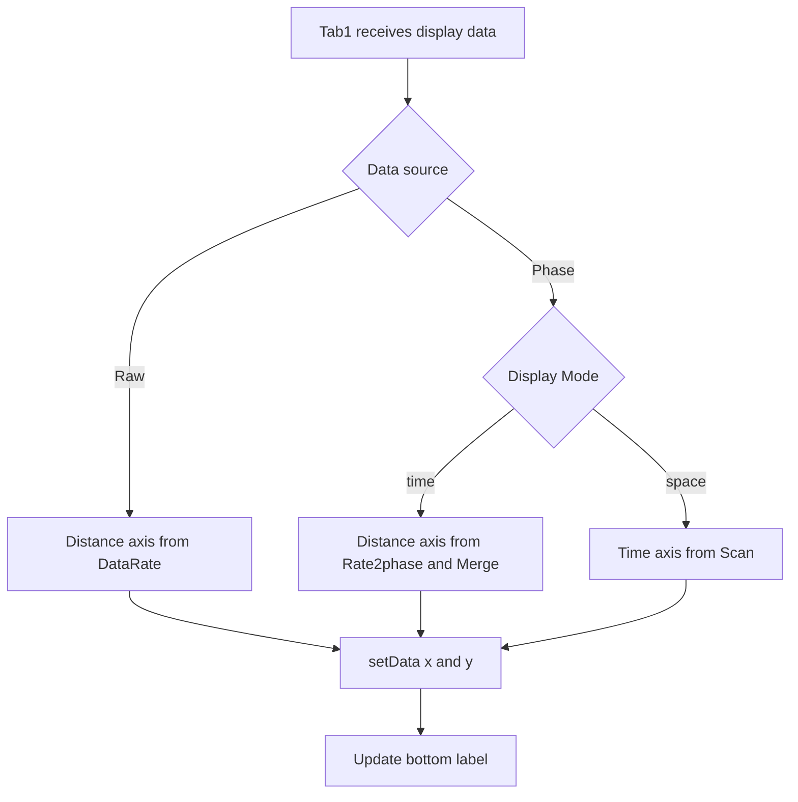

# 2026-6-17 Tab1 时域图坐标轴修改日志

## 1. 修改背景

Tab1 的 Time Plot 原先在更新曲线时只向 pyqtgraph 传入 y 轴数据，横轴由 pyqtgraph 默认生成 0 基样本序号。该显示方式不能直接反映 Raw 与 Phase 数据在当前采集参数下对应的物理距离或时间。

本次修改后，Tab1 时域图的横轴随数据源和显示模式自动切换：

- Raw 模式：横轴为 `Distance (m)`。
- Phase 模式且 `Mode=time`：横轴为 `Distance (m)`。
- Phase 模式且 `Mode=space`：横轴为 `Time (s)`。

## 2. 坐标轴规则

### 2.1 Raw 模式

Raw 模式下，横轴代表距离，点间距由 Upload parameters 中的 `DataRate` 决定。当前软件内部 `data_rate` 保存的是采样间隔，单位为 ns：

$$
\Delta x_{\mathrm{raw}} = 0.1 \times \mathrm{DataRate}\ \mathrm{m}
$$

`DataRate=4ns (250MHz)` 时，$\Delta x_{\mathrm{raw}}=0.4\ \mathrm{m}$；`DataRate=8ns (125MHz)` 时，$\Delta x_{\mathrm{raw}}=0.8\ \mathrm{m}$。

若 `Points` 表示每帧点数，则横轴数组为：

$$
x_{\mathrm{raw}} = [1, 2, 3, \ldots, \mathrm{Points}] \times \Delta x_{\mathrm{raw}}
$$

### 2.2 Phase 模式，Mode=time

Phase 模式的 `Mode=time` 分支显示空间波形叠加，横轴代表距离。点间距由 Phase demod parameters 中的 `Rate2phase` 和 `Merge` 共同决定：

$$
\Delta x_{\mathrm{phase}} = 0.4 \times \mathrm{Rate2phase} \times \mathrm{Merge}\ \mathrm{m}
$$

例如 `Rate2phase=250M` 时，软件内部值为 $1$；若 `Merge=20`，则 $\Delta x_{\mathrm{phase}}=8\ \mathrm{m}$。

Phase 每帧有效点数为：

$$
N_{\mathrm{phase}} = \left\lfloor\frac{\mathrm{Points}}{\mathrm{Merge}}\right\rfloor
$$

因此横轴数组为：

$$
x_{\mathrm{phase,time}} = [1, 2, 3, \ldots, N_{\mathrm{phase}}] \times \Delta x_{\mathrm{phase}}
$$

### 2.3 Phase 模式，Mode=space

Phase 模式的 `Mode=space` 分支显示某一空间位置随时间变化的曲线，横轴代表时间。点间距由 `Scan(Hz)` 决定：

$$
\Delta t = \frac{1}{\mathrm{Scan}}\ \mathrm{s}
$$

若 `Scan=2000Hz`，则 $\Delta t=0.0005\ \mathrm{s}$。显示帧数由 `FramePlot` 控制；刚开始数据不足时使用当前可用帧数 `frame_num`。

$$
x_{\mathrm{phase,space}} = [1, 2, 3, \ldots, frame\_num] \times \frac{1}{\mathrm{Scan}}
$$

## 3. 实现方案

本次修改集中在 `src/main_window.py` 的 Tab1 显示更新链路中完成。新增 `_raw_distance_axis()`、`_phase_distance_axis()`、`_phase_time_axis()` 三个坐标数组辅助方法，并统一通过 `_set_time_plot_bottom_label()` 设置横轴标签。

## 4. 影响范围

本次只改变 Tab1 时域图的横轴物理坐标和标签，不改变采集线程、`FrameLoad`、`FramePlot` 显示快照、频谱计算、Tab2 Time-Space 和 Monitor 图逻辑。

## 5. 验证记录

- 执行 `python -m py_compile src/main_window.py` 检查语法。
- 使用 Python 验证 Raw、Phase-Time、Phase-Space 三组典型坐标公式。
- 使用 Python 以 `encoding='utf-8'` 读取本次涉及的代码与文档，确认中文可正常解码，中文行中没有异常问号字符。

## 6. 现场验证建议

1. Raw 模式，`DataRate=4ns (250MHz)`，确认横轴标签为 `Distance (m)`，点间距为 $0.4\ \mathrm{m}$。
2. Raw 模式，`DataRate=8ns (125MHz)`，确认点间距为 $0.8\ \mathrm{m}$。
3. Phase 模式，`Mode=time`，`Rate2phase=250M` 且 `Merge=20`，确认点间距为 $8\ \mathrm{m}$。
4. Phase 模式，`Mode=space`，`Scan=2000Hz`，确认横轴标签为 `Time (s)`，点间距为 $0.0005\ \mathrm{s}$。
