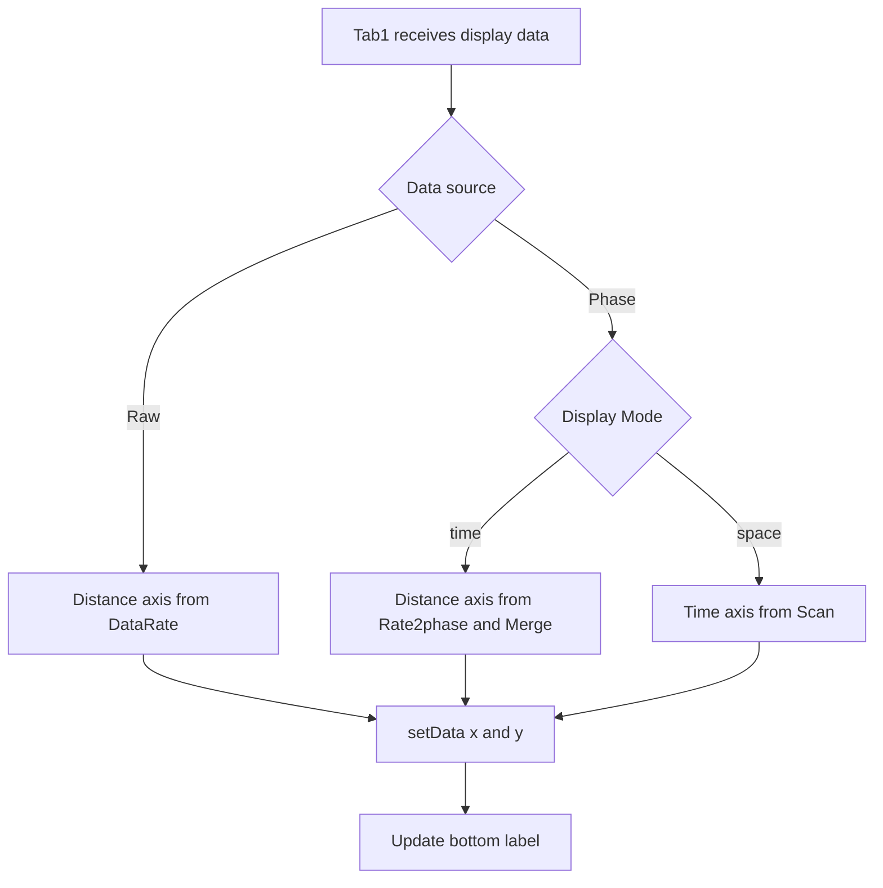
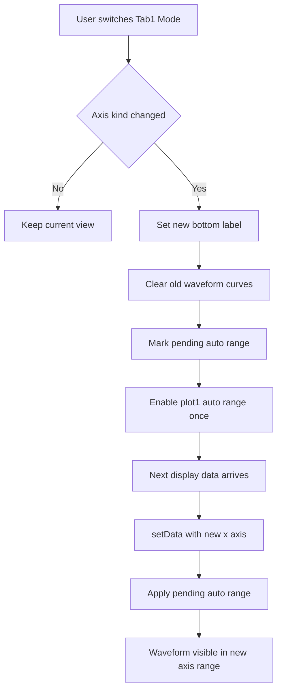
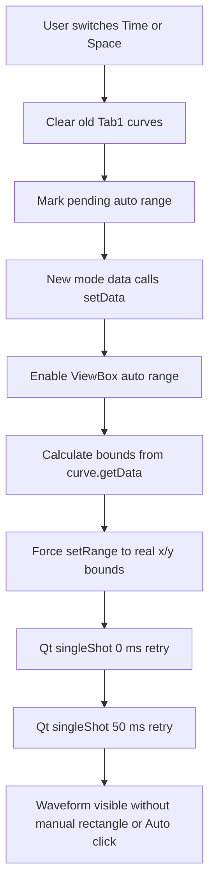
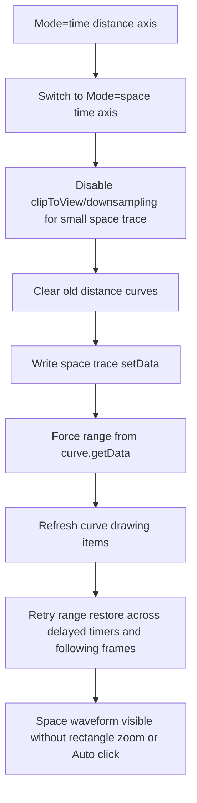

# 2026-6-17 Tab1 时域图坐标轴修改日志

## 1. 修改背景

Tab1 的 Time Plot 原先在更新曲线时只向 pyqtgraph 传入 y 轴数据，横轴由 pyqtgraph 默认生成 0 基样本序号。该显示方式不能直接反映 Raw 与 Phase 数据在当前采集参数下对应的物理距离或时间。

本次修改后，Tab1 时域图的横轴随数据源和显示模式自动切换：

- Raw 模式：横轴为 `Distance (m)`。
- Phase 模式且 `Mode=time`：横轴为 `Distance (m)`。
- Phase 模式且 `Mode=space`：横轴为 `Time (s)`。

## 2. 坐标轴规则

### 2.1 Raw 模式

Raw 模式下，横轴代表距离，点间距由 Upload parameters 中的 `DataRate` 决定。当前软件内部 `data_rate` 保存的是采样间隔，单位为 ns：

$$
\Delta x_{\mathrm{raw}} = 0.1 \times \mathrm{DataRate}\ \mathrm{m}
$$

`DataRate=4ns (250MHz)` 时，$\Delta x_{\mathrm{raw}}=0.4\ \mathrm{m}$；`DataRate=8ns (125MHz)` 时，$\Delta x_{\mathrm{raw}}=0.8\ \mathrm{m}$。

若 `Points` 表示每帧点数，则横轴数组为：

$$
x_{\mathrm{raw}} = [1, 2, 3, \ldots, \mathrm{Points}] \times \Delta x_{\mathrm{raw}}
$$

### 2.2 Phase 模式，Mode=time

Phase 模式的 `Mode=time` 分支显示空间波形叠加，横轴代表距离。点间距由 Phase demod parameters 中的 `Rate2phase` 和 `Merge` 共同决定：

$$
\Delta x_{\mathrm{phase}} = 0.4 \times \mathrm{Rate2phase} \times \mathrm{Merge}\ \mathrm{m}
$$

例如 `Rate2phase=250M` 时，软件内部值为 $1$；若 `Merge=20`，则 $\Delta x_{\mathrm{phase}}=8\ \mathrm{m}$。

Phase 每帧有效点数为：

$$
N_{\mathrm{phase}} = \left\lfloor\frac{\mathrm{Points}}{\mathrm{Merge}}\right\rfloor
$$

因此横轴数组为：

$$
x_{\mathrm{phase,time}} = [1, 2, 3, \ldots, N_{\mathrm{phase}}] \times \Delta x_{\mathrm{phase}}
$$

### 2.3 Phase 模式，Mode=space

Phase 模式的 `Mode=space` 分支显示某一空间位置随时间变化的曲线，横轴代表时间。点间距由 `Scan(Hz)` 决定：

$$
\Delta t = \frac{1}{\mathrm{Scan}}\ \mathrm{s}
$$

若 `Scan=2000Hz`，则 $\Delta t=0.0005\ \mathrm{s}$。显示帧数由 `FramePlot` 控制；刚开始数据不足时使用当前可用帧数 `frame_num`。

$$
x_{\mathrm{phase,space}} = [1, 2, 3, \ldots, frame\_num] \times \frac{1}{\mathrm{Scan}}
$$

## 3. 实现方案

本次修改集中在 `src/main_window.py` 的 Tab1 显示更新链路中完成。新增 `_raw_distance_axis()`、`_phase_distance_axis()`、`_phase_time_axis()` 三个坐标数组辅助方法，并统一通过 `_set_time_plot_bottom_label()` 设置横轴标签。

## 4. 影响范围

本次只改变 Tab1 时域图的横轴物理坐标和标签，不改变采集线程、`FrameLoad`、`FramePlot` 显示快照、频谱计算、Tab2 Time-Space 和 Monitor 图逻辑。

## 5. 验证记录

- 执行 `python -m py_compile src/main_window.py` 检查语法。
- 使用 Python 验证 Raw、Phase-Time、Phase-Space 三组典型坐标公式。
- 使用 Python 以 `encoding='utf-8'` 读取本次涉及的代码与文档，确认中文可正常解码，中文行中没有异常问号字符。

## 6. 现场验证建议

1. Raw 模式，`DataRate=4ns (250MHz)`，确认横轴标签为 `Distance (m)`，点间距为 $0.4\ \mathrm{m}$。
2. Raw 模式，`DataRate=8ns (125MHz)`，确认点间距为 $0.8\ \mathrm{m}$。
3. Phase 模式，`Mode=time`，`Rate2phase=250M` 且 `Merge=20`，确认点间距为 $8\ \mathrm{m}$。
4. Phase 模式，`Mode=space`，`Scan=2000Hz`，确认横轴标签为 `Time (s)`，点间距为 $0.0005\ \mathrm{s}$。

## 7. 2026-06-17 补充修复：Phase Space 模式波形不可见

### 7.1 问题现象

在 Phase 模式下切换到 `Mode=space` 后，Tab1 时域图横轴标签会变为 `Time (s)`，但界面上可能看不到时域波形。

### 7.2 原因分析

上一轮修改后，Phase-Time 分支的横轴单位为距离，典型范围是米级；Phase-Space 分支的横轴单位为时间，典型范围是秒级。例如 `Scan=2000Hz`、`FramePlot=1024` 时，时间横轴范围为：

$$
[1,2,\ldots,1024] \times \frac{1}{2000} = [0.0005, 0.512]\ \mathrm{s}
$$

如果用户曾经在 Tab1 中框选、平移或滚轮缩放，`ZoomablePlotViewBox` 会关闭自动范围并保留当前视图范围。当显示模式从距离轴切换为时间轴时，旧的米级 x 轴范围会继续生效，新的秒级波形落在视野之外，因此表现为无法显示时域波形。

该问题不是数据抽取失败，也不是 `space_data` 为空，而是横轴物理单位切换后 ViewBox 仍沿用旧坐标范围。

### 7.3 修复方案

本次在 `src/main_window.py` 中新增 Tab1 横轴状态跟踪变量 `_time_plot_axis_kind`，并新增 `_set_time_plot_axis()` 方法统一处理横轴标签和横轴语义切换。后续现场反馈表明，单次立即恢复自动范围仍可能发生在新模式曲线写入之前，因此又增加 `_time_plot_pending_auto_range` 和 `_apply_pending_time_plot_auto_range()`，把最终的自动范围恢复延迟到下一次 `setData(x, y)` 完成之后执行。

当横轴类型在 `distance` 与 `time` 之间切换时，程序会执行以下动作：

1. 更新 Tab1 底部标签，例如 `Distance (m)` 或 `Time (s)`。
2. 清空旧曲线，避免旧单位数据残留。
3. 设置 `_time_plot_pending_auto_range=True`，记录需要在下一批新数据写入后再次恢复自动范围。
4. 对 `plot1` 立即调用一次 `_restore_plot_auto_range()`，解除当前缩放锁定。
5. 下一次新模式曲线完成 `setData(x, y)` 后调用 `_apply_pending_time_plot_auto_range()`，再次执行 `_restore_plot_auto_range()`，确保 ViewBox 基于新坐标数据重新计算范围。
6. 记录日志 `Tab1 time plot axis changed`，便于后续定位模式切换行为。

`_on_mode_changed()` 中也同步调用 `_set_time_plot_axis()`，使用户点击 `Time` 或 `Space` 单选按钮时立即解除旧缩放状态；随后下一帧数据进入 `_update_phase_display()` 并写入新横轴数据后，再执行一次自动范围恢复，保证波形直接出现在新的时间轴或距离轴范围内。

### 7.4 修复后的显示逻辑

### 7.5 二次优化记录

现场再次验证发现，若从 `Mode=time` 切到 `Mode=space`，有时需要先矩形放大再点击自动范围按钮，波形才会出现；从 `Mode=space` 切回 `Mode=time` 也可能需要手动点击自动范围按钮。该现象说明只在模式切换瞬间调用 `_restore_plot_auto_range()` 仍不够稳定，因为当时旧曲线刚被清空，新模式的 `setData(x, y)` 还没有执行，ViewBox 没有新的数据边界可用于计算范围。

因此最终策略改为两阶段：

$$
\mathrm{axis\ switch} \rightarrow \mathrm{pending\ auto\ range} \rightarrow \mathrm{setData}(x,y) \rightarrow \mathrm{autoRange}
$$

该策略等效于程序在新曲线真正写入后自动点击一次 `Auto/View All`，用户不再需要通过手动画矩形或手动点击自动范围按钮来触发波形显示。

### 7.6 2026-06-18 三次优化记录

现场再次反馈表明，二次优化后问题仍未完全消除：Phase 模式下从 `Mode=time` 切换到 `Mode=space` 后，仍可能需要先在绘图控件中画矩形放大，再点击 `Auto/View All` 才能看到波形；从 `Mode=space` 切回 `Mode=time` 后，也可能仍需点击自动范围按钮。

本次判断该问题已经不是“是否在 `setData(x, y)` 之后调用自动范围”的单一时序问题，而是 pyqtgraph 的 ViewBox、PlotDataItem 边界缓存和 Qt 事件循环之间仍存在异步窗口。也就是说，程序虽然已经在新曲线写入后调用了 `_restore_plot_auto_range()`，但当时 ViewBox 可能仍没有拿到稳定的曲线数据边界，导致自动范围计算沿用旧状态或得到无效范围。

因此本次在 `src/main_window.py` 中新增两层兜底：

1. 新增 `_curve_data_range()`，直接从当前 Tab1 曲线的 `getData()` 结果中读取有限的 `x/y` 数据，并计算真实边界，不再只依赖 ViewBox 内部缓存。
2. 新增 `_force_plot_range_to_curve_data()`，在解除缩放锁定后，使用曲线真实边界对 `plot1` 执行一次确定性的 `setRange()`，确保时间轴秒级范围或距离轴米级范围立即落入可视区域。
3. `_apply_pending_time_plot_auto_range()` 在同步恢复范围后，通过 `QTimer.singleShot(0, ...)` 和 `QTimer.singleShot(50, ...)` 再执行两次延迟恢复。第一次等待当前 Qt 事件循环完成，第二次覆盖部分机器上 PlotDataItem 边界更新稍晚的情况。
4. 延迟恢复会检查横轴类型是否仍与触发时一致，若用户已经再次切换 `Time/Space`，旧的延迟任务不会覆盖新模式视图。

优化后的流程变为：

本次修改仍不改变 Raw、Phase-Time、Phase-Space 的坐标公式，也不改变采集线程、保存线程、FrameLoad、FramePlot、Spectrum 和 Tab2 Time-Space 图逻辑。它只增强 Tab1 时域图在横轴物理单位切换后的视图恢复确定性。

### 7.7 2026-06-18 四次优化记录

三次优化后现场反馈显示，`Mode=space` 切回 `Mode=time` 已经可以直接出现波形，说明距离轴恢复链路基本有效；但 `Mode=time` 切换到 `Mode=space` 后仍可能需要先矩形放大，再点击自动范围按钮才显示波形。该方向性差异说明问题更集中在秒级时间轴 Space 曲线的绘制刷新，而不是通用的横轴标签或坐标公式错误。

本次进一步检查后，Space 模式的 Tab1 曲线只有 `FramePlot` 个时间点，通常远小于 Time 模式下每帧空间点数，不需要 `clipToView + auto downsampling` 这套大曲线优化。旧视图仍处于米级距离范围时，`clipToView` 可能先按旧范围裁剪出空路径；随后即使程序恢复了 ViewBox 范围，PlotDataItem 的绘制路径也可能没有及时刷新，因此用户需要通过矩形缩放和 Auto 按钮触发一次完整重绘。

本次在 `src/main_window.py` 中补充以下处理：

1. 新增 `_configure_time_plot_curves_for_axis()`。当 Tab1 横轴切到 `time` 时，临时关闭 `plot_curve_1` 的 `clipToView` 和自动降采样；切回 `distance` 时恢复实时大曲线优化。
2. 新增 `_time_plot_auto_range_frames_remaining`。横轴单位切换后，不只在第一帧执行一次范围恢复，而是在后续若干帧继续尝试按真实曲线范围恢复视图，直到计数耗尽或用户手动缩放。
3. `_apply_pending_time_plot_auto_range()` 的延迟重试从 `0 ms`、`50 ms` 扩展到 `0 ms`、`50 ms`、`150 ms`、`300 ms`，覆盖现场机器上曲线边界或绘制路径更新更慢的情况。
4. `_force_plot_range_to_curve_data()` 在 `setRange()` 后调用 `_refresh_plot_curve_items()`，主动刷新曲线绘制项、PlotItem 和 ViewBox，避免秒级 Space 曲线在旧裁剪路径下保持空白。

优化后的 time -> space 流程为：

本次修改仍限定在 Tab1 视图恢复和曲线绘制刷新层，不改变 Phase-Space 的数据抽取方式，也不改变 `x=[1,2,\ldots,frame\_num]/Scan` 的时间轴公式。
