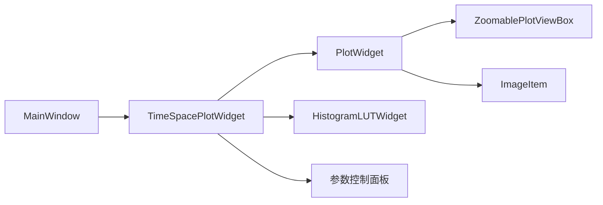

# Time-Space Plot 技术架构文档（基于当前版本代码）

## 1. 文档目的

本文档面向开发者，说明当前 `src/time_space_plot.py` 的真实实现结构，以及它与 `src/main_window.py`、`src/plot_interaction.py` 的协作关系。Time-Space 图在这个项目里并不是一个普通的二维图，而是实时采集系统中的高频刷新控件。它既要承受持续数据输入，又要保证用户可以稳定缩放、观察颜色范围并在必要时锁定局部视图，因此它的设计必须同时关注显示语义、交互语义和性能语义。

与早期只讨论“应该用什么控件画二维图”的文档不同，当前版本更强调为什么要这样画、这样做避免了哪些历史问题，以及哪些路径是后续类似项目中值得继续复用的。

## 2. 当前架构选择

当前 Time-Space 模块采用的是 `PlotWidget + ImageItem + HistogramLUTWidget` 组合，而不是 `ImageView` 或手工拼装的 `QGraphicsScene`。选择这套架构的根本原因，是它同时满足三件事：可以稳定控制坐标轴、可以精确管理颜色条和颜色范围、可以与项目内统一的 `ViewBox` 交互逻辑衔接。

`PlotWidget` 负责坐标轴、网格、视图范围和整体绘图容器；`ImageItem` 承载真正的二维图像矩阵；`HistogramLUTWidget` 负责颜色条、levels 管理和颜色映射展示。通过 `ZoomablePlotViewBox` 替换默认 `ViewBox` 后，Time-Space 图还能和主界面其他实时图共享同一套缩放和恢复视图行为。

这套结构的最大收益，是把“二维显示”和“控件逻辑”拆开了。ImageItem 只管显示矩阵，PlotWidget 管坐标系，HistogramLUTWidget 管颜色条，交互逻辑则由 ViewBox 单独处理。相比把所有事情都堆到某个黑盒控件里，这种显式拆分更适合持续演化。

## 3. 数据进入 Time-Space 的路径

当前版本中，Time-Space 图并不直接接触 DLL 或采集线程。它的数据来自 `MainWindow._update_phase_display()`，也就是说，它处理的是已经经过当前显示链路筛选后的 PHASE 显示快照，而不是采集线程每次读取的完整原始块。主窗口会根据当前 `FramePlot`、裁剪后的点数和显示模式，从最新显示快照中选择合适的帧块，再调用 Time-Space 控件更新。

这意味着 Time-Space 图的输入数据已经处于“为显示服务”的语境中。它要做的事情主要包括：根据距离范围裁剪数据、按时间和空间降采样、写入滚动显示缓冲，并把缓冲内容映射到正确的物理坐标区域。它不是保存链路，也不是协议链路，因此后续维护时不能为了让图更容易画而反向污染主采集数据结构。

## 4. 固定滚动显示缓冲的设计动机

当前版本最关键的改动，是抛弃“每次更新都把历史块 `concatenate` 成一整张新图”的路径，改为维护固定大小滚动显示缓冲。这样做是因为在实时采集场景下，频繁拼接大矩阵会带来两种问题。第一，持续内存分配和复制会让主线程开销迅速上升；第二，图像更新延迟一旦增长，用户即使只想看最新状态，也会被历史显示重建拖慢。

因此，Time-Space 控件内部维护一块固定大小的显示缓冲，并记录当前有效块数、每块显示宽度、空间点数和时间尺度。当新的处理块到来时，如果缓冲尚未写满，就把新块追加到右侧有效区域；如果缓冲已写满，则按滚动窗口语义把旧内容左移，再把新块写入右端。这个模型直接体现了当前控件的显示哲学：优先稳定展示最近窗口，而不是无限保留历史。

## 5. 距离范围、时间降采样与空间降采样

当前控件对用户暴露了距离范围起止、时间降采样和空间降采样等参数。它们的作用都发生在显示控件内部，而不是回写采集参数。距离范围控制显示窗口在空间维度上只保留指定点段，时间降采样控制在一块帧数据中按时间方向抽取样本，空间降采样则控制在空间方向上按指定步长取点。

如果设原始输入块在 GUI 语境中的形状为 $F \times P$，其中 $F$ 是帧数、$P$ 是当前每帧有效点数；距离范围裁剪后保留区间长度为 $P_r$；时间降采样因子为 $d_t$，空间降采样因子为 $d_s$，那么进入显示缓冲的块大小近似变为

$$
F_{\mathrm{disp}} = \left\lceil \frac{F}{d_t} \right\rceil,
\qquad
P_{\mathrm{disp}} = \left\lceil \frac{P_r}{d_s} \right\rceil
$$

这说明 Time-Space 控件既能通过距离范围减少空间方向负担，也能通过时间/空间降采样减轻二维显示压力。对现场用户来说，这些参数是“看图负载控制器”；对开发者来说，它们是 GUI 可用性的重要保险丝。

## 6. 坐标轴语义与物理映射

当前版本明确把横轴定义为时间、纵轴定义为距离点号。也就是说，缓冲中矩阵的每一列对应一段时间窗口中的显示列，每一行对应处理后的空间点。为了让图像和坐标轴语义保持一致，控件会基于扫描率和当前显示块宽度计算每块对应的时间跨度，并通过 `ImageItem.setRect()` 把图像矩阵映射到物理坐标区域。

如果一个显示块包含的源帧数为 $F_{\mathrm{src}}$，时间降采样为 $d_t$，扫描率为 $R$，则单个显示块覆盖的时间长度可理解为

$$
T_{\mathrm{disp\_block}} = \frac{F_{\mathrm{src}}}{R}
$$

实际显示矩阵在水平方向上的采样列数可能因降采样减少，但它所代表的物理时间跨度并不因此缩短。当前实现通过保存块持续时间和显示宽度来保持这一层语义一致性，这比简单把数组索引当横纵坐标更可靠。

## 7. 颜色条与颜色范围控制

颜色条当前由 `HistogramLUTWidget` 提供，但当前版本的重点不是“能显示颜色条”，而是“颜色范围行为必须稳定”。历史问题之一，是在更新过程中重复绑定 `setImageItem()` 或让颜色条交互和输入框交互相互抢控制权，结果导致用户设置的 `vmin/vmax` 被运行期自动范围覆盖。现在的策略是：颜色映射和图像绑定在初始化阶段建立，之后颜色范围主要由控制面板中的 `vmin/vmax` 单向驱动，颜色条自身的 level 区域不再作为主要输入源。

这一改动的工程意义很大。对于实时图来说，颜色条若不稳定，用户看到的“变亮/变暗”很可能只是自动范围改变，而不是数据本身变化。当前版本通过把颜色范围控制权集中到明确的参数输入上，降低了这种误判风险，也让参数恢复功能更容易做成可预测行为。

## 8. 缩放交互与“缩放锁定”

Time-Space 图的缩放交互不是独立设计的，而是与主界面其他实时图统一使用 `ZoomablePlotViewBox`。这意味着用户在 Time-Space 图上也可以使用左键框选放大、滚轮缩放、`Shift + 左键拖拽` 横向平移以及右键 `View All` 恢复全视图。主窗口同时维护缩放锁定状态，确保用户手动放大后，实时刷新不会立刻把视图拉回自动范围。

这类逻辑对离线图而言可能只是体验增强，但对实时图而言是刚需。因为用户通常不是为了看全局而盯着一张持续变化的图，而是为了盯住某个局部区域观察它是否持续异常。如果每次刷新都把视图重置，实时图就失去了分析价值。

## 9. 为什么 Time-Space 图不直接复用保存数据

从开发者视角看，最容易犯的错误之一是试图让 Time-Space 图直接消费保存链路中的数据结构，理由通常是“保存最完整，所以显示也该直接用它”。当前项目没有这么做，原因很现实：保存链路关心的是完整归档，显示链路关心的是最新可视化；两者的优先级、节流策略和数据整形方式都不同。若强行复用一条链路，迟早会在性能或语义上出问题。

当前版本把 Time-Space 图明确放在显示侧，这保证了它可以自由使用显示快照、时间降采样和空间降采样，而不必影响保存和通信。对于后续类似项目，这种“显示模块只对显示负责”的边界非常重要。

## 10. 当前实现的局限与后续可优化方向

虽然当前版本已经比早期实现稳定得多，但它仍有明确边界。第一，显示缓冲写满后的滚动更新仍然涉及整块移动，这在更大窗口和更高刷新率下可能再次成为瓶颈。第二，当前纵轴仍以点号为主，而不是直接换算到米或公里，这对工程人员很直观，但对最终用户未必最友好。第三，Time-Space 图目前只服务于 PHASE 显示语境，若未来希望对 Raw 或其他数据源提供二维可视化，需要重新界定物理意义，而不是直接套现有控件。

如果后续要继续优化，建议优先评估两件事：一是是否有必要把滚动缓冲进一步改成环形索引结构，以减少写满后的整体搬移；二是是否需要把“点号到物理距离”的换算显式纳入控件层，而不仅仅在外部状态栏或标签中显示。

## 11. 可复用经验总结

Time-Space 模块最值得复用的经验，不是具体 API，而是三条设计原则。第一，二维实时图必须明确显示语义，不能只是把矩阵 `imshow` 出来。第二，颜色范围、缩放交互和滚动缓冲都要视为核心功能，而不是后补的体验项。第三，实时显示应围绕“展示最近窗口且允许用户稳定观察局部”来设计，而不是围绕“保留全部历史刷新动作”来设计。这三条原则同样适用于很多高速传感、声学阵列、振动监测和工业视觉项目。