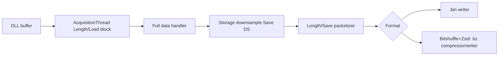

# eDAS 数据存储技术说明（Length 参数模型）

本文面向开发和现场联调，说明当前 `pcie7821_gui` 的保存链路。自 2026-07-29 起，界面存储参数统一改为以秒为单位的 Length 模型：

- `Length/Load`：一次 DLL 读取的数据时长，位于 Tab4，默认 `0.2 s`。
- `Length/Save`：一次保存包的数据时长，位于 Tab4，默认 `1 s`。
- `Length/File`：一个输出文件的数据时长，位于 Tab4，默认 `10 s`。
- `Save DS`：保存侧点抽样因子，只影响落盘，不影响显示、滤波或 TCP 通信。
- `Format`：`BIN (.bin)` 或 `Bitshuffle+Zstd (.bz)`。

旧界面中的 `Blocks/File`、`BZ Packet Frames`、`BZ File(s)` 已从用户参数中移除。`.bin` 和 `.bz` 现在使用同一组 `Length/Save` 与 `Length/File` 参数。保存器内部仍会把秒数换算成帧数和 packet 数，但这些是派生运行值，不再要求用户直接填写。

## 1. 数据流结构

采集线程从 DLL 缓冲区读取完整 `Length/Load` 数据块后，完整块直接进入后台消费者，GUI 只消费最新显示快照。保存链路不依赖 GUI 绘图回调。



这条链路的核心原则是：保存拿完整采集数据，显示只拿最新快照。`rad`、PSD、Tab1/Tab2 FILTER、Time-Space 视图裁剪都不会改变保存数据值。

## 2. Length 参数到帧数的换算

所有 Length 参数在界面中以秒显示，运行前按 `Scan(Hz)` 换算为整数帧数：

```text
load_frames = round(Length/Load * ScanRate)
plot_frames = round(Length/Plot * ScanRate)
save_frames = round(Length/Save * ScanRate)
file_frames = round(Length/File * ScanRate)
```

校验规则：

```text
Length/Plot 必须是 Length/Load 的整数倍
Length/Save 必须是 Length/Load 的整数倍
Length/File 必须是 Length/Save 的整数倍
```

例如默认 `ScanRate=2000 Hz` 时：

```text
Length/Load = 0.2 s -> 400 frames
Length/Save = 1.0 s -> 2000 frames = 5 个 load block
Length/File = 10.0 s -> 20000 frames = 10 个 save packet
```

## 3. .bin 保存行为

`.bin` 文件仍是裸二进制连续数据流，不额外写 packet header。变化在于写入节奏：旧版本按每个 `FrameLoad` 采集块直接写入，并按 `Blocks/File` 分文件；当前版本会先把多个 `Length/Load` 采集块聚合到 `Length/Save`，再写入当前 `.bin` 文件。

当前 `.bin` 保存行为：

```text
1 个采集块 = Length/Load 对应的帧数
1 个保存包 = Length/Save 对应的帧数
1 个文件 = Length/File 对应的帧数
```

如果默认 `Length/Load=0.2 s`、`Length/Save=1 s`、`Length/File=10 s`，则后台保存器每 5 个采集块写一次保存包，每 10 个保存包切换到下一个文件。

`.bin` 文件内容仍按 `int32` 连续写入。Raw 数据如果以非 `int32` 进入保存器，保存器会转换为 `int32` 后落盘。PHASE 数据本身通常已经是 `int32`。离线解析 `.bin` 时必须结合日志或同名运行参数确认：

- `ScanRate`
- `Length/Save`
- `Length/File`
- 数据源 Raw/PHASE
- 通道数
- 每帧有效点数
- 是否使用单通道 PHASE crop
- `Save DS`

## 4. .bz 保存行为

`.bz` 仍是自描述的 Bitshuffle+Zstd packet 文件格式。当前 UI 不再暴露 `BZ Packet Frames` 和 `BZ File(s)`，而是用统一的：

```text
packet_frames = Length/Save * ScanRate
file_frames = Length/File * ScanRate
```

`.bz` 文件由 `BZF1` 文件头和多个 `BZS1` packet 组成。每个 packet 先做 bitshuffle，再用 zstd 压缩。Tab4 仍保留两个压缩相关参数：

- `Zstd Level`：默认 `3`。
- `Bitshuffle Block`：默认 `65536` 个 int32 值。

`.bz` 和 `.bin` 的保存节奏现在一致：默认每 1 秒形成一个保存包，每 10 秒切一个文件。区别只是 `.bin` 写连续 int32 字节流，`.bz` 写带 packet header 的压缩包。

## 5. Save DS

`Save DS` 是保存侧专用点抽样因子，默认 `1` 表示不抽样。设置为 `N` 时，每帧按点位保留：

```text
0, N, 2N, 3N, ...
```

它只影响落盘数据，不影响：

- Tab1 波形显示
- PSD
- Tab1/Tab2 FILTER
- Time-Space 显示
- Tab3 TCP 通信

多通道数据会按每帧点位抽样并保留完整通道列，避免通道错位。

## 6. 文件大小估算

保存平均吞吐主要由每帧有效点数、`Save DS`、`ScanRate`、通道数和单点字节数决定：

```text
saved_points_per_frame = ceil(source_points_per_frame / SaveDS)
bytes_per_second = saved_points_per_frame * ScanRate * ChannelNum * bytes_per_point
file_bytes = bytes_per_second * Length/File
```

当前保存器保守按 `int32` 估算：

```text
bytes_per_point = 4
```

`Length/Load` 不改变每秒总数据量，只改变 DLL 单次读取大小和读取频率。`Length/Save` 不改变每秒总数据量，只改变后台写盘/压缩包粒度。`Length/File` 决定单文件目标时长和单文件大小。

## 7. 队列和实时性判断

保存器前端仍使用非阻塞队列。采集侧入队失败时会丢弃当前待保存块或 packet，并记录 `dropped_blocks`。这条策略优先保护采集线程和 GUI 不被磁盘反压拖死。

现场判断保存链路是否健康，应重点看日志中的：

- `queue_size` / `raw_queue_size`
- `.bz` 的 `compressed_queue_size`
- `pending_frames / packet_frames`
- `dropped_blocks`
- `.bz` 的 `compression_not_realtime_count`
- `last_write_ms`
- `.bz` 的 `last_compress_ms`

如果队列持续上升、`dropped_blocks` 增加，或者 `.bz` 的 `compression_not_realtime_count` 增加，说明保存链路跟不上实时采集。此时应降低采集负载、增大 `Save DS`、降低压缩等级、缩小 `Length/Save` 或改用 `.bin` 验证磁盘吞吐。

## 8. 新旧参数对照

| 旧参数 | 新参数 | 说明 |
|---|---|---|
| `FrameLoad` | `Length/Load` | 从“帧数”改为“秒”，运行时换算成一次 DLL 读取帧数。 |
| `FramePlot` | `Length/Plot` | 从“帧数”改为“秒”，可以大于 `Length/Load`，显示链路会跨多个采集块保留最新窗口。 |
| `Blocks/File` | `Length/File` | 不再按采集块个数分文件，改为按文件目标时长分文件。 |
| `BZ Packet Frames` | `Length/Save` | `.bin` 和 `.bz` 统一使用保存包时长。 |
| `BZ File(s)` | `Length/File` | `.bin` 和 `.bz` 统一使用文件时长。 |

## 9. 离线解析建议

`.bin` 文件本身仍不自描述，离线解析前至少要确认：数据源、通道数、保存点数、`Length/Save`、`Length/File`、`Save DS`、PHASE merge/crop 参数和采集开始时间。

PHASE 单通道 `.bin` 常见恢复方式：

```text
matrix = int32_file.reshape(total_frames, effective_points_per_frame_after_SaveDS)
```

如果需要恢复为弧度显示值：

```text
phase_rad = phase_int32 / 32767 * pi
```

`.bz` 文件头会记录更多元数据，但由于 `Length/File` 的运行边界实际以帧数控制，离线工具最好以 packet header 中的 `frames` 为准恢复总帧数，而不是只依赖文件名或目标时长。

## 7. 近期更新（2026-08-12）

- Tab 3 `.bz` 存储线程保留队列水位和丢弃统计：`raw_queue_size/max`、`packet_queue_size/max`、`compressed_queue_size/max`、`dropped_count`、`packet_queue_full_count`、`compressed_queue_full_count`。
- `.bz` 压缩实时性指标已拆分：`slow_compression_packet_count` 表示单包压缩耗时超过对应采集时长；`compression_not_realtime_count` 仅表示队列满、打包/压缩失败等明确实时链路风险。
- Tab 3 存储状态栏现在显示 `.bz dropped / queue / max / slow / notRT / full`，区分“压缩慢但队列健康”和“实时存储链路异常”。
- `.bz` 停止日志会输出最终队列峰值、丢弃数、慢压缩包数、队列满次数、worker 数和最大压缩耗时，便于从测试日志直接判断是否存在实时存储丢数据。
- 采集线程周期日志新增 `api_read_ms`、`dispatch_ms`、`display_pub_ms`、`save_slow_compress` 等字段，用于关联采集缓冲积压、GUI 显示压力和本地保存状态。
