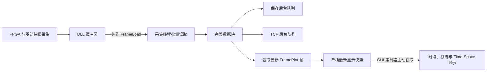

# FrameLoad 与 FramePlot 参数使用说明

## 1. 文档目的

`FrameLoad` 和 `FramePlot` 都以“帧”为单位，但它们控制的是数据链路中的不同阶段。`FrameLoad` 决定上位机每次从 DLL 缓冲区批量读取多少帧，直接影响单次读取块的大小、等待时长和 DLL 调用频率；`FramePlot` 决定每次显示刷新最多使用多少帧，只影响显示快照、时域波形、频谱和 Time-Space 图等可视化处理，不改变 FPGA 的采集速率，也不改变每秒需要从采集卡搬运的总数据量。

理解这两个参数的边界非常重要。如果把 `FramePlot` 调小但保持较大的 `FrameLoad`，可以降低进入 GUI 显示链路的数据量，但不能降低单次 DLL 读取的数据量。如果把 `FrameLoad` 调小，则会降低单次读取块大小和单次阻塞时间，但会增加每秒调用 DLL 读取接口的次数。

## 2. FrameLoad 的实际含义

`FrameLoad` 是上位机软件的批量读取参数，不是通过设备配置接口直接写入 FPGA 的硬件参数。设备启动后，FPGA 和驱动按照 `ScanRate`、`Points`、通道数和数据源等参数持续产生并缓存数据。上位机采集线程查询 DLL 缓冲区中的可用点数，当可用数据达到一个 `FrameLoad` 数据块后，再调用 DLL 读取接口取走这一批数据。

对于 Raw 单通道数据，单次读取块大小可按下式计算：

$$
B_{\mathrm{raw}} =
\mathrm{Points}
\times
\mathrm{FrameLoad}
\times
\mathrm{Channels}
\times
2
$$

式中，Raw 数据每点使用 `int16`，因此每点占用 $2$ 字节。对于 Phase 数据，合并后的每帧点数为：

$$
\mathrm{PhasePoints} =
\frac{\mathrm{Points}}{\mathrm{MergePointNum}}
$$

Phase 单次读取块大小为：

$$
B_{\mathrm{phase}} =
\mathrm{PhasePoints}
\times
\mathrm{FrameLoad}
\times
\mathrm{Channels}
\times
4
$$

Phase 数据每点使用 `int32`，因此每点占用 $4$ 字节。一个 `FrameLoad` 数据块覆盖的采集时间为：

$$
T_{\mathrm{block}} =
\frac{\mathrm{FrameLoad}}{\mathrm{ScanRate}}
$$

例如，使用 `ScanRate=2000`、`Points=20480`、单通道 Raw 数据和 `FrameLoad=1024` 时，单次读取块大小为：

$$
20480 \times 1024 \times 1 \times 2
= 41943040\ \mathrm{bytes}
= 40\ \mathrm{MiB}
$$

对应的数据块时长为：

$$
\frac{1024}{2000}
= 0.512\ \mathrm{s}
$$

这意味着上位机约每 $0.512$ 秒需要完成一次 $40\ \mathrm{MiB}$ 数据块的读取、必要的内存复制以及后续分发。持续数据率约为：

$$
\frac{40\ \mathrm{MiB}}{0.512\ \mathrm{s}}
= 78.125\ \mathrm{MiB/s}
$$

降低 `FrameLoad` 不会改变这个持续数据率，但会把大块读取拆成更多小块读取。例如将 `FrameLoad` 从 `1024` 降到 `128` 后，单块大小会从 $40\ \mathrm{MiB}$ 降到 $5\ \mathrm{MiB}$，单块覆盖时间会从 $512\ \mathrm{ms}$ 降到 $64\ \mathrm{ms}$，每秒 DLL 调用次数则相应增加。

## 3. FramePlot 的实际含义

`FramePlot` 是显示侧参数，表示每次 GUI 更新最多使用最新的多少帧。它不参与 FPGA 配置，也不决定采集线程每次从 DLL 读取多少数据。当前优化后的程序会在采集线程完成一整个 `FrameLoad` 数据块读取后，从中截取最新的 `FramePlot` 帧，复制成独立的显示快照。GUI 定时器只取走最新快照；如果 GUI 尚未处理上一个快照，新快照会直接覆盖旧快照，不会把历史大数组持续排入 Qt 事件队列。

`FramePlot` 对不同显示模式的作用有所区别。在时域叠加模式中，程序最多绘制前四条曲线，但显示快照仍可能用于频谱分析和其他显示处理。在空间模式中，程序需要从多帧数据中提取同一空间位置的时间序列，因此较大的 `FramePlot` 会提供更长的时间窗口。Time-Space 图同样使用显示快照中的帧数构建可视区域。

当 `FramePlot` 小于 `FrameLoad` 时，完整采集块仍会送入保存队列或 TCP 后台队列，但 GUI 只持有较小的显示快照。例如 `FrameLoad=1024`、`FramePlot=128` 时，DLL 仍按 1024 帧读取和保存，而 GUI 最多只接收最新 128 帧用于显示。这样可以在保持完整数据保存的同时，降低 GUI 内存占用和绘图压力。

## 4. 优化后的数据流

优化前，采集线程会把每个完整数据块通过 Qt 信号发送到 GUI 主线程。对于较大的 Raw 数据块，即使 GUI 最终只绘制少量曲线，完整大数组仍会进入 Qt 事件队列。当采集线程发送速度高于 GUI 处理速度时，历史数据回调和绘图事件会积压，导致波形更新卡顿，并使停止信号延迟执行。

优化后的数据流将完整数据处理和显示处理分离。完整数据直接进入线程安全的保存队列或 TCP 后台队列，不再经过 GUI 事件队列。显示侧只保留一个按 `FramePlot` 截取的最新快照，并由 GUI 定时器主动消费。

单槽最新显示快照的含义是：系统最多保留一份尚未显示的数据。如果 GUI 来不及处理，新的快照会替换旧快照。实时显示因此优先展示最新状态，而不是滞后地播放历史数据。完整数据保存不受显示丢帧影响，只要保存队列和磁盘吞吐能够跟上采集速率，保存文件仍包含完整数据块。

## 5. 参数调整方法

现场调参时，应先根据数据源、点数、通道数和扫描率计算持续数据率，再选择合理的 `FrameLoad`。`FrameLoad` 的目标不是越小越好，而是在“单次 DLL 调用开销”和“单块数据过大造成的阻塞风险”之间取得平衡。单块过大时，DLL 调用、内存复制和停止响应容易出现长时间阻塞；单块过小时，每秒 DLL 调用次数过高，也可能增加锁竞争和调用开销。

对于 `ScanRate=2000`、`Points=20480`、单通道 Raw 数据，建议先从 `FrameLoad=128` 或 `256` 开始测试。应重点观察日志中的 `read_ms`、`query_ms`、缓冲区点数和 `read_age_s`。理想状态下，单次读取耗时应明显小于该数据块覆盖的采集时间，驱动缓冲区点数不应持续单调增长。

`FramePlot` 应根据实际显示需求设置。若主要查看 Raw 时域波形，可以从 `FramePlot=4`、`16` 或 `64` 开始；若需要较长的空间点时间序列或 Time-Space 时间窗口，再逐步增大。通常应满足：

$$
1 \leq \mathrm{FramePlot} \leq \mathrm{FrameLoad}
$$

如果降低 `FramePlot` 后 GUI 明显流畅，但驱动缓冲区仍持续增长，说明显示压力已经降低，剩余瓶颈主要位于 DLL、驱动或持续数据吞吐链路。如果降低 `FrameLoad` 后 `read_ms` 明显下降、STOP 响应改善且驱动缓冲区不再持续增长，则说明原来的单次读取块过大。

## 6. STOP 与停滞检测说明

优化后的 STOP 流程不再等待历史 Raw 数据回调处理完成。点击 STOP 后，程序会立即停止消费显示快照、清理尚未显示的数据，并恢复参数控件状态；随后请求采集线程停止、停止硬件、等待采集线程退出，并关闭保存和 TCP 会话。旧采集线程延迟到达的停止信号会被识别并忽略，不会错误地影响下一轮采集。

停滞检测也不再根据 GUI 是否及时执行数据回调进行判断，而是根据采集线程最近一次成功读取数据的时间进行判断。日志字段 `read_age_s` 表示距离最近一次成功读取已经过去的秒数。这样，单纯的 GUI 绘图卡顿不会再被误判为底层采集停滞。

停止后，程序不会继续周期性打印已停止采集线程的诊断快照。如果终端仍有其他日志，需要根据日志模块名称判断是否来自保存、TCP 或系统状态更新，而不能仅凭“终端仍有输出”判断采集是否还在运行。
